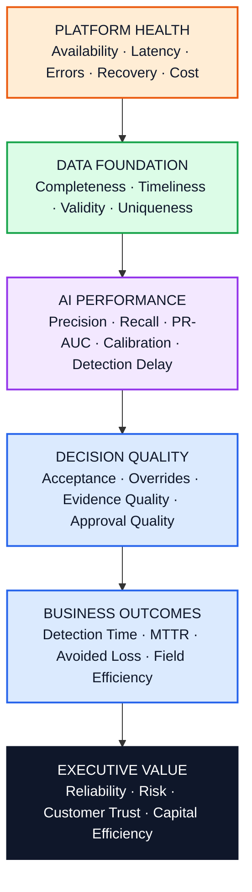
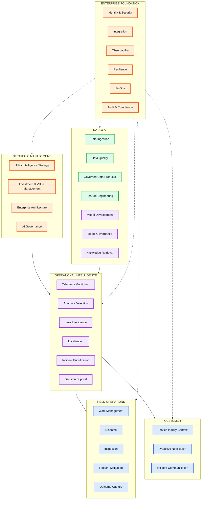
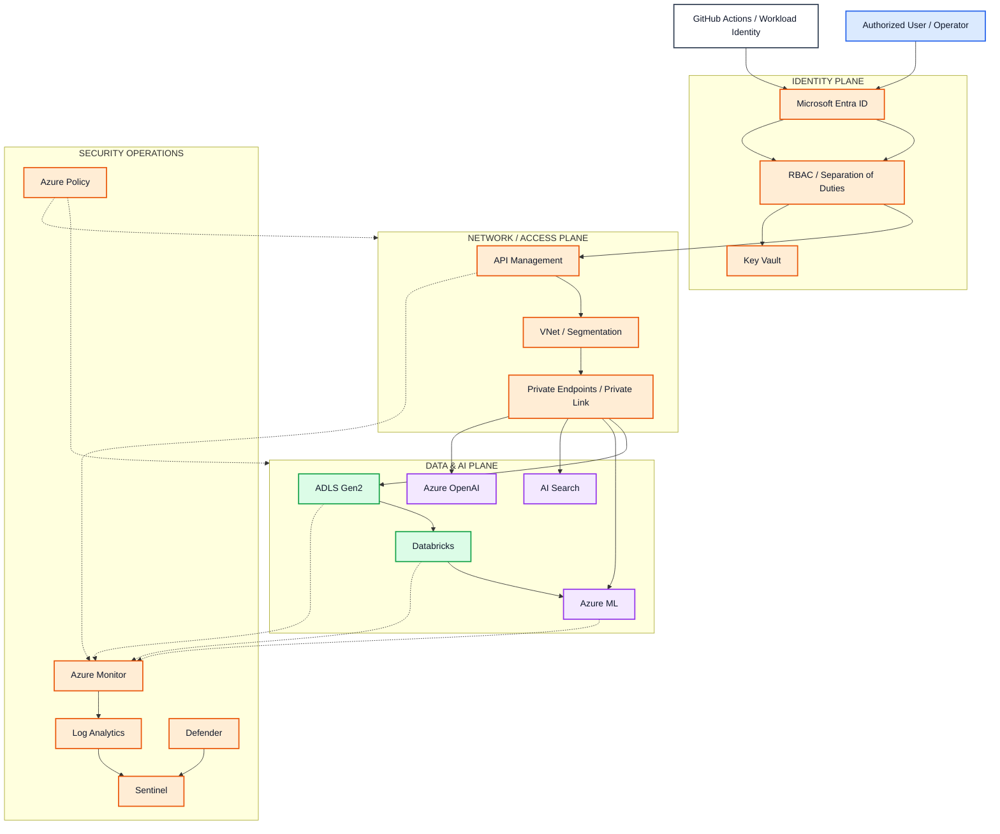
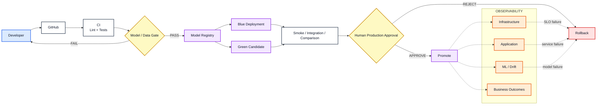

# Velaqua Water Intelligence Platform

[](https://github.com/DougMoore123/Velaqua-Water-intelligence-Platform/actions/workflows/ci.yml)

## Enterprise AI Decision Intelligence for Water Distribution Networks

**Enterprise Architecture · Microsoft Azure · Data Engineering · Predictive AI · MLOps · GenAI/RAG · Responsible AI · Human-in-the-Loop Governance**

> **Velaqua Solutions** is an enterprise smart-water intelligence platform designed to transform distributed water-network telemetry into prioritized incidents, predictive risk, grounded operational evidence, and governed human decision support.

| Platform Attribute | Current Position |
|---|---|
| Data acquisition | ADF batch ingestion and Event Hub streaming |
| Data engineering | Databricks bronze/silver/gold processing with schema and quality validation |
| ML / model lifecycle | Azure ML training, evaluation, registry, and approval gates |
| Decision layer | FastAPI incident and prediction services with human approval controls |
| Evidence layer | Azure AI Search + Azure OpenAI with grounding and citations |
| Governance | CI/CD, monitoring, SLOs, security baselines, and rollback controls |

The system is designed around five operating principles:

- **Operational value:** prioritize missed-leak reduction, early detection, and business impact rather than model scores alone.
- **Traceability:** link source telemetry, features, predictions, decisions, RAG evidence, and approvals with `incident_id` and `asset_id`.
- **Controlled autonomy:** material field actions require an explicit human approval record.
- **Release discipline:** model and service changes move through quality gates, blue/green validation, smoke tests, and rollback capability.
- **Evidence over invention:** RAG responses are grounded in retrieved documents, cite their sources, and fall back deterministically when dependencies fail.

## Operating Model and Decision Logic

The implementation is structured as a production operating loop rather than a single model notebook. Data and telemetry are validated, transformed, scored, routed to decision logic, and then grounded with retrieval evidence before a human approval gate is reached.

Key operating relationships:

- Operational Value = Risk Reduction + Cost Efficiency + Faster Response Time
- Priority Score = Leak Risk(x_t) × Estimated Business Impact($)
- Release Eligible = Tests Passed ∧ Security Checks Passed ∧ Model Gate Passed ∧ Human Approval Present
- System Health = Data Quality ∧ Model Quality ∧ Service Reliability ∧ Governance Readiness

This reflects the same governance pattern used across the operational docs and release runbooks in [docs/architecture.md](docs/architecture.md), [docs/monitoring_validation_playbook.md](docs/monitoring_validation_playbook.md), [docs/rag_quality_and_safety.md](docs/rag_quality_and_safety.md), [docs/cicd_and_governance_checklist.md](docs/cicd_and_governance_checklist.md), [docs/aml_v1_realtime_endpoint_ops.md](docs/aml_v1_realtime_endpoint_ops.md), and [docs/blue_green_release_runbook.md](docs/blue_green_release_runbook.md).

## Current Validation Snapshot

The following results were generated by rerunning the repository's model, test, and operational metrics flows on August 14, 2026. Runtime monitoring used 800 baseline and 1,200 current synthetic prediction records. These runtime values validate the instrumentation and pipeline wiring; they are not a substitute for production telemetry.

| Area | Result | Interpretation |
|---|---:|---|
| Automated test suite | **35 passed, 0 failed** | Engineering and contract checks are green |
| Ruff lint | **All checks passed** | No lint violations in source and test scopes |
| Average inference latency | **145.09 ms** | Below the 350 ms SLO |
| P95 / P99 latency | **201.59 / 218.02 ms** | Below the 1,000 / 1,500 ms SLOs |
| Estimated throughput | **6.89 RPS** | Synthetic current-window estimate |
| Availability | **99.67%** | Above the 99.5% SLO |
| Error rate | **0.67%** | Below the 1% SLO |
| Average CPU / memory | **33.72% / 47.95%** | Below the 80% warning threshold |
| Average detection delay | **6.88 minutes** | Below the 20-minute monitoring threshold |
| Prediction drift PSI | **0.032** | Stable relative to baseline |
| Confidence drift PSI | **0.205** | Borderline; requires monitoring |
| Missing value rate | **7.98%** | Above the 3% data-quality threshold |

The report is persisted at [governance/monitoring_report.json](governance/monitoring_report.json). The input logs are generated runtime artifacts under `data/monitoring/` and are intentionally ignored by Git.

## Architecture

```text
Sensors / SCADA / EPANET
        |
        v
ADF batch + Event Hub streaming
        |
        v
ADLS Gen2 raw -> Databricks bronze -> silver -> gold
        |
        v
Azure ML feature engineering and model suite
        |
        +--> AML realtime and batch endpoints
        |          |
        |          v
        |    FastAPI decision API ----> CMMS / field / customer workflows
        |          |
        |          v
        |    Azure AI Search + Azure OpenAI RAG evidence package
        |
        v
Azure Monitor / Application Insights / Log Analytics
Microsoft Sentinel / Purview / Entra ID / Key Vault / Defender
```

### Capability layers

1. **Data acquisition:** ADF batch ingestion and Event Hub streaming.
2. **Data engineering:** Databricks/PySpark bronze-silver-gold processing, schema enforcement, and data-quality checks.
3. **ML development:** feature engineering, model-suite training, calibration, threshold sensitivity, stress testing, and lineage.
4. **Model governance:** production candidate selection, performance gate, data sufficiency gate, model registration, and approval records.
5. **Serving:** AML CLI v1 realtime and batch deployments with blue/green release controls.
6. **Decision intelligence:** FastAPI endpoints for prediction, incident orchestration, approvals, readiness, and executive KPIs.
7. **Evidence synthesis:** Azure AI Search retrieval and Azure OpenAI generation with citations, context limits, blocklists, and deterministic fallback.
8. **Operations:** dashboards and integration contracts for CMMS, field workflows, customer service, and executive reporting.
9. **Governance:** CI/CD, observability, security baselines, cost controls, ownership, retraining triggers, and rollback procedures.

## Model Evaluation Results

Model metrics are generated by [ml/training/src/train_model_suite.py](ml/training/src/train_model_suite.py) and stored under [ml/training/artifacts/model_suite](ml/training/artifacts/model_suite). The authoritative human-readable findings are in [governance/model_findings_summary.md](governance/model_findings_summary.md).

### Model suite

The current training snapshot contains 37 rows: 3 real rows and 34 synthetic rows. The real-only holdout contains 1 test row, so the perfect test scores below are directional and must not be interpreted as production evidence.

| Candidate | Precision | Recall | F1 | PR-AUC | Business net value |
|---|---:|---:|---:|---:|---:|
| Isolation Forest (selected) | 1.000 | 1.000 | 1.000 | 1.000 | $2,500 |
| Random Forest | 0.000 | 0.000 | 0.000 | 0.000 | $0 |
| XGBoost | 0.000 | 0.000 | 0.000 | 0.000 | $0 |

The table above is the one-row test classification result. The full per-class precision, recall, F1, accuracy, and support values are available in the generated [Isolation Forest classification report](governance/model_classification_reports/isolation_forest.json), [Random Forest classification report](governance/model_classification_reports/random_forest.json), and [XGBoost classification report](governance/model_classification_reports/xgboost.json). The original per-model artifacts remain under the local model-suite output directory.

### Scenario robustness

The selected Isolation Forest candidate has a cross-scenario mean F1 of **0.514**.

| Scenario | Precision | Recall | F1 |
|---|---:|---:|---:|
| Small leak | 0.500 | 0.500 | 0.500 |
| Large leak | 0.531 | 0.588 | 0.558 |
| Different leak locations | 0.481 | 0.515 | 0.498 |
| Demand spike | 0.402 | 0.573 | 0.473 |
| Pressure variation | 0.387 | 0.573 | 0.462 |
| Sensor noise | 0.398 | 0.573 | 0.470 |
| Missing sensors | 0.438 | 0.560 | 0.491 |
| Extreme values | 0.446 | 0.773 | 0.566 |
| Partial telemetry | 0.423 | 0.611 | 0.500 |
| Malformed inputs | Handled | Handled | N/A |

### Production gate

All model-quality conditions pass, but the candidate remains blocked by data sufficiency:

| Gate | Requirement | Actual | Status |
|---|---:|---:|---|
| Precision | >= 0.75 | 1.00 | Pass |
| Recall | >= 0.80 | 1.00 | Pass |
| PR-AUC | >= 0.80 | 1.00 | Pass |
| False-alarm frequency | <= 2/day | 0.00 | Pass |
| Business net value | > $0 | $2,500 | Pass |
| Real training rows | >= 200 | 3 | **Blocked** |
| Real validation rows | >= 30 | 1 | **Blocked** |
| Real test rows | >= 100 | 1 | **Blocked** |
| Real test leaks | >= 10 | 1 | **Blocked** |

**Verdict: do not promote to production until the real-data minimums are met and the candidate is retrained.**

### Model artifact index

- [model_suite_summary.json](ml/training/artifacts/model_suite/model_suite_summary.json): aggregate model, data, calibration, and business metrics.
- [scenario_test_report.json](ml/training/artifacts/model_suite/scenario_test_report.json): robustness and malformed-input results.
- [production_candidate.json](ml/training/artifacts/model_suite/production_candidate.json): selected model, lineage, and gate verdict.
- [model_findings_summary.md](governance/model_findings_summary.md): generated summary of model performance and findings.
- Each local model directory contains `classification_report.json`, `evaluation_report.json`, `confusion_matrix_test.json`, `calibration_test.json`, and `threshold_sensitivity_val.csv`.
- Published classification reports: [governance/model_classification_reports](governance/model_classification_reports)

## Operational Monitoring Metrics

The operational report is generated by [scripts/monitor_operational_metrics.py](scripts/monitor_operational_metrics.py). It consumes JSONL prediction logs with latency, confidence, score, labels, status, resource, and business-outcome fields.

```bash
python scripts/monitor_operational_metrics.py \
  --baseline data/monitoring/baseline_predictions.jsonl \
  --current data/monitoring/current_predictions.jsonl \
  --output governance/monitoring_report.json
```

### Request and resource metrics

| Metric | Observed | Threshold | Status |
|---|---:|---:|---|
| Average latency | 145.09 ms | < 350 ms | Pass |
| P95 latency | 201.59 ms | < 1,000 ms | Pass |
| P99 latency | 218.02 ms | < 1,500 ms | Pass |
| Availability | 99.67% | >= 99.5% | Pass |
| Error rate | 0.67% | < 1.0% | Pass |
| Average CPU | 33.72% | < 80% | Pass |
| Average memory | 47.95% | < 80% | Pass |

### Data quality, drift, and outcomes

| Metric | Observed | Threshold | Status |
|---|---:|---:|---|
| Missing value rate | 7.98% | < 3% | **Watch** |
| Duplicate rate | 0.00% | — | Pass |
| Schema changes | None | None | Pass |
| Prediction drift PSI | 0.032 | < 0.2 | Pass |
| Confidence drift PSI | 0.205 | < 0.2 | **Watch** |
| Average detection delay | 6.88 min | < 20 min | Pass |
| False-alarm rate | 67.5% | < 10% | Not production-valid |
| Missed-leak rate | 33.7% | < 5% | Not production-valid |

False-alarm and missed-leak values came from synthetic logs and should not be used for a go-live decision. The missing-rate and confidence-drift findings are useful instrumentation signals, but must be remeasured on representative real telemetry.

## Findings and Go-Live Decision

### Positive findings

- The full automated test suite is green: **35 passed, 0 failed**.
- Runtime latency, availability, error rate, CPU, memory, and detection-delay checks meet their defined thresholds.
- Prediction score drift is low at PSI 0.032.
- The API includes request IDs, rate limiting, validation, readiness checks, authorization gates, and integration fanout contracts.
- RAG behavior includes grounding enforcement, citations, context limits, safety blocklists, retries, and deterministic fallback.
- Release automation includes candidate checks, registration, realtime blue deployment, smoke testing, blue/green comparison, rollback, promotion, and human approval.

### Blocking findings

1. **Insufficient real data:** the current model gate requires 200 real training rows, 30 real validation rows, 100 real test rows, and 10 real test leaks. The current snapshot has 3, 1, 1, and 1 respectively.
2. **Approval record incomplete:** production promotion remains blocked until [governance/production_approval_record.json](governance/production_approval_record.json) contains `approved_by`, `approved_at`, and `change_ticket`.
3. **Synthetic monitoring warnings:** missing values are above threshold and confidence drift is borderline. Re-run monitoring with production-like telemetry before accepting the SLO verdict.
4. **Azure live validation remains environment-dependent:** monitoring, security, autoscaling, endpoint, and RAG provisioning scripts require Azure permissions and environment variables.

### Recommended next actions

1. Ingest and quality-check representative real sensor telemetry.
2. Rebuild gold features and rerun the complete model suite and scenario tests.
3. Re-evaluate the model and human approval gates.
4. Deploy the approved candidate to blue, run smoke and load tests, then deploy green.
5. Compare blue and green outputs, validate rollback, and promote only after sign-off.
6. Establish Azure Monitor baselines and replace synthetic monitoring logs with production telemetry.

## Repository Structure

```text
.
├── .github/workflows/       CI, CD, and repository governance workflows
├── infra/bicep/             Azure infrastructure as code
├── platform/                ADF, Event Hub, Databricks, and ingestion assets
├── ml/training/             Features, training, evaluation, and model artifacts
├── ml/deployment/           AML endpoint definitions, schemas, and scoring
├── services/decision_api/   FastAPI decision and incident API
├── services/rag_service/    Retrieval and evidence synthesis API
├── services/shared/         Shared request and response contracts
├── scripts/                 Deployment, release, monitoring, security, and gates
├── governance/              SLOs, ownership, approvals, and readiness review
├── docs/                    Architecture and operational runbooks
├── tests/                   Unit, API, model, schema, deployment, and gate tests
├── notebooks/               VS Code notebook execution evidence
└── dashboards/              Dashboard integration notes
```

## Getting Started

### Prerequisites

- Python 3.10+ (3.11+ recommended)
- Azure CLI authenticated to the target subscription
- Access to the Azure ML workspace and resource group
- Optional: Databricks, Azure AI Search, Azure OpenAI, Application Insights, and Sentinel access

### Existing Azure workspace

The current workspace configuration is:

| Setting | Value |
>>>>>>> d16a6ff (Align README with operating model and governance docs)
|---|---|
| **Business Domain** | Water Utility Intelligence |
| **Architecture Pattern** | Cloud-native, event-ready, governed enterprise AI |
| **Primary Predictive Benchmark** | LeakG3PD — Net3 |
| **Cloud Platform** | Microsoft Azure |
| **Data Platform** | ADLS Gen2 + Azure Databricks / PySpark |
| **ML Platform** | Azure Machine Learning + MLflow |
| **Decision Intelligence** | FastAPI |
| **GenAI / RAG** | Azure AI Search + Azure OpenAI |
| **Infrastructure as Code** | Azure Bicep |
| **CI/CD** | GitHub Actions |
| **Release Position** | **Pre-Production Reference Implementation** |
| **Production Decision** | **NO-GO until defined release gates are satisfied** |

---

# Executive Summary

Modern water utilities generate large volumes of operational data across smart meters, pressure and flow sensors, SCADA systems, hydraulic models, pumps, tanks, asset-management platforms, work-management systems, and customer-service environments.

The enterprise problem is not simply acquiring telemetry.

The harder problem is converting fragmented operational signals into a **timely, explainable, traceable, financially defensible, and accountable decision**.

Velaqua addresses that problem as an end-to-end **AI decision-intelligence platform**.

The platform combines:

- governed batch and streaming ingestion,
- medallion data engineering,
- data-quality controls,
- network-aware feature engineering,
- predictive leak intelligence,
- temporal model validation,
- model lifecycle governance,
- real-time and batch serving patterns,
- API-based decision intelligence,
- retrieval-augmented operational evidence,
- explicit human authorization,
- enterprise security,
- observability,
- resilience,
- FinOps,
- CI/CD,
- blue/green deployment,
- rollback,
- and closed-loop operational learning.

A foundational architecture principle is:

> **A model prediction is not the business outcome.**

Velaqua therefore deliberately separates **predictive intelligence** from **operational authority**.

AI may detect, classify, prioritize, localize, explain, and recommend.

Material field actions remain subject to accountable human authorization.

The current implementation uses **LeakG3PD Net3** as its primary predictive-AI benchmark while preserving a platform architecture capable of supporting future live AMI, SCADA, IoT, GIS, CMMS, asset, field-service, and customer-service integration.

---

# Table of Contents

- [Strategic Context](#strategic-context)
- [Business Problem](#business-problem)
- [Business Goals](#business-goals)
- [Success Measurement](#success-measurement)
- [Stakeholders & Decision Rights](#stakeholders--decision-rights)
- [Strategic SWOT](#strategic-swot)
- [Architecture Principles](#architecture-principles)
- [Business Capability Architecture](#business-capability-architecture)
- [Enterprise AI Architecture](#enterprise-ai-architecture)
- [Architecture Lifecycle](#architecture-lifecycle)
- [Data Architecture](#data-architecture)
- [Predictive AI Architecture](#predictive-ai-architecture)
- [Decision Intelligence & RAG](#decision-intelligence--rag)
- [Security Architecture](#security-architecture)
- [MLOps & Release Engineering](#mlops--release-engineering)
- [Observability & Resilience](#observability--resilience)
- [Model Governance](#model-governance)
- [Responsible AI](#responsible-ai)
- [FinOps & Business Value](#finops--business-value)
- [Current Validation Evidence](#current-validation-evidence)
- [Production Release Gates](#production-release-gates)
- [Repository Structure](#repository-structure)
- [Getting Started](#getting-started)
- [Testing](#testing)
- [Deployment](#deployment)
- [Known Limitations](#known-limitations)
- [Roadmap](#roadmap)
- [Engineering Position](#engineering-position)

---

# Strategic Context

Velaqua Solutions is a fictional B2B smart-water technology organization used to model the enterprise architecture, AI, data, integration, security, governance, and operating requirements of a modern utility-intelligence provider.

The platform sits between:

**physical infrastructure → operational telemetry → AI intelligence → human decisions → field execution**

The initiative is intentionally designed as an **enterprise transformation program**, not as a standalone machine-learning experiment.

```text
Physical Water Network
        ↓
Operational Telemetry
        ↓
Governed Data
        ↓
Predictive Intelligence
        ↓
Risk + Confidence + Evidence
        ↓
Human Decision
        ↓
Field / Business Action
        ↓
Operational Outcome
        ↓
Closed-Loop Learning
```

The desired transformation is from:

> fragmented signals and reactive investigation

to:

> governed, evidence-backed, proactive operational intelligence.

---

# Business Problem

A typical water-utility incident may require multiple systems, teams, and manual handoffs.

```text
Operational Signal
        ↓
Alarm / Customer Complaint
        ↓
Investigation
        ↓
Engineering Diagnosis
        ↓
Leak Localization
        ↓
Risk Prioritization
        ↓
Operational Authorization
        ↓
Field Dispatch
        ↓
Inspection / Repair
        ↓
Incident Closure
        ↓
Outcome Capture
```

Common structural constraints include:

- siloed telemetry,
- fragmented operational context,
- point-to-point integration,
- scheduled and file-based data movement,
- manual evidence correlation,
- specialist dependency,
- inconsistent alert thresholds,
- false-positive burden,
- slow localization,
- incomplete model and data lineage,
- reactive work-management processes,
- limited closed-loop learning,
- weak cross-platform governance,
- inconsistent observability,
- and delayed customer communication.

Velaqua introduces a governed intelligence layer across this lifecycle.

---

# Business Goals

The strategic objective is to create a reusable enterprise AI capability that improves the **speed, quality, economics, and accountability of water-network decisions**.

| ID | Business Objective | Strategic Intent | Primary KPI Family |
|---|---|---|---|
| **BO-01** | Reduce detection-to-triage time | Identify material anomalies earlier and surface ranked operational incidents | Median detection-to-triage time; % detected before complaint |
| **BO-02** | Improve incident localization | Narrow suspected location and affected assets before dispatch | Localization accuracy; search-area reduction; MTTR |
| **BO-03** | Reduce avoidable field activity | Increase dispatch precision and provide better pre-investigation evidence | Truck rolls per confirmed incident; first-visit resolution |
| **BO-04** | Reduce water-loss exposure | Support earlier identification and resolution of leakage conditions | Leak duration; estimated avoided loss; confirmed leak volume |
| **BO-05** | Improve operator decision quality | Provide explainable risk, confidence, evidence, and history | Alert acceptance; override rate; decision-cycle time |
| **BO-06** | Improve customer-service responsiveness | Provide trusted operational context for service inquiries | Handle time; repeat contacts; proactive notifications |
| **BO-07** | Create a reusable enterprise data and AI foundation | Standardize telemetry, interfaces, lineage, monitoring, and governance | DQ SLOs; API reuse; model deployment lead time |
| **BO-08** | Maintain executive control of risk and cost | Make reliability, control health, and economics visible | SLO attainment; control exceptions; cost per endpoint / incident |

---

# Success Measurement

Velaqua is not evaluated solely by model accuracy.

Success is measured across the complete value chain.

| Measurement Domain | Representative Metrics | Why It Matters |
|---|---|---|
| **Business / Operations** | Detection-to-triage, MTTR, incident-cycle time, field dispatches | Demonstrates operational improvement |
| **Water / Asset** | Leak duration, confirmed leak volume, avoided-loss estimate | Connects AI to physical-network value |
| **Decision Quality** | Alert acceptance, override rate, approval rate, investigation burden | Measures human usefulness and trust |
| **Predictive AI** | Precision, recall, F1, PR-AUC, calibration, detection delay | Measures model behavior |
| **Data Quality** | Completeness, timeliness, validity, uniqueness | Measures trustworthiness of the data foundation |
| **Platform / SRE** | Availability, p95/p99 latency, error rate, recovery | Measures service reliability |
| **Governance / Risk** | Audit completeness, model exceptions, security findings | Measures enterprise control |
| **FinOps** | Cost per endpoint, prediction, incident, training run | Measures economic sustainability |

## KPI Hierarchy



## Business Target Policy

Utility-specific benefit targets are **not invented**.

Until representative customer discovery and baseline measurement are available:

```text
Business baseline = TBD — utility discovery required
Business target   = TBD — accountable stakeholder approval required
```

This prevents a portfolio benchmark from being presented as realized utility value.

---

# Stakeholders & Decision Rights

Velaqua spans business, operational, engineering, field, data, AI, security, and governance domains.

## Stakeholder Model

**R = Responsible · A = Accountable · C = Consulted · I = Informed**

| Stakeholder | Primary Accountability | Decision Need | RACI |
|---|---|---|---|
| **Executive Sponsor / Utility GM** | Strategic outcomes, funding, risk acceptance | Value realization, service reliability, investment governance | **A** |
| **Utility Operations Director** | Network operations and incident response | Detection speed, prioritization, response quality | **A/R** |
| **Network Operations Analyst** | Day-to-day intelligence use | Ranked incidents and lower investigation burden | **R** |
| **Water / Hydraulic Engineer** | Domain authority | Localization, hydraulic plausibility, engineering evidence | **C/R** |
| **Asset Management Lead** | Asset strategy | Criticality, maintenance, lifecycle risk | **C** |
| **Field Service Supervisor** | Dispatch and field execution | Safe and precise work execution | **R** |
| **Field Technician** | Inspection and repair | Location, evidence, procedures, feedback | **R** |
| **Customer Service Leader** | Customer-response process | Trusted operational context | **C** |
| **Enterprise / Solution Architect** | Architecture coherence | Security, interoperability, resilience, standards | **R** |
| **Data Engineering Lead** | Governed data products | Quality, timeliness, lineage, contracts | **R** |
| **ML / AI Lead** | Model lifecycle | Performance, explainability, drift, model risk | **R** |
| **Cybersecurity / IAM** | Security controls | Identity, least privilege, monitoring, exceptions | **A/R** |
| **Data Governance / Compliance** | Data policy and auditability | Lineage, retention, accountability | **A/R** |
| **Product / Customer Success** | Adoption and value | Repeatability and realized customer value | **R/C** |

## Decision Rights

| Decision | Accountable Owner | Architecture Principle |
|---|---|---|
| Model recommendation | AI / Analytics service | AI may recommend; it does not authorize material action |
| Incident validation | Operations / Engineering | Human evaluates operational evidence |
| Field dispatch | Authorized utility role | Human authorization required |
| Repair execution | Field operations | Governed procedures and safety controls |
| Model promotion | ML + Governance approver | Performance, risk, lineage, monitoring, rollback required |
| Security exception | Security + accountable executive | Time-bounded documented risk acceptance |

---

# Strategic SWOT

The SWOT is used as a consulting input to architecture decisions, not as a substitute for requirements engineering.

| **Strengths** | **Weaknesses** |
|---|---|
| Unified business-to-AI architecture | AI value depends on representative, high-quality telemetry |
| Explainable decision intelligence with human control | Current model evidence is not sufficient for production promotion |
| Reusable Azure architecture | Integration complexity across heterogeneous utility systems |
| Governed data and model lifecycle | Field-feedback quality affects closed-loop learning |
| Closed-loop operational design | Some target integrations require real customer environments |

| **Opportunities** | **Threats** |
|---|---|
| Reduce non-revenue-water exposure | Cybersecurity risk to critical infrastructure |
| Predictive maintenance and asset intelligence | Model drift and network-condition changes |
| AMI / SCADA / GIS / CMMS integration | Operator distrust or automation bias |
| Demand forecasting and pressure optimization | False positives or missed events |
| Multi-utility architecture reuse | Regulatory / contractual requirements |
| RAG-assisted investigation | Prompt injection, poisoning, misinformation |
| Executive analytics and FinOps | Cloud / GenAI cost growth |

## SWOT-to-Architecture Mapping

| Strategic Finding | Architecture Response |
|---|---|
| Telemetry quality dependence | Data contracts, DQ gates, quarantine, lineage |
| Cybersecurity threat | Zero Trust, Entra ID, RBAC, Key Vault, Defender, Sentinel |
| Model drift | ML monitoring, retraining triggers, rollback |
| Operator trust | Confidence, evidence, explainability, human approval |
| Utility variation | Canonical contracts and loosely coupled integration |
| GenAI risk | Grounded retrieval, citations, bounded agency |
| Cost growth | FinOps, budgets, unit economics, workload right-sizing |
| Need for real feedback | Structured incident and field-outcome capture |

---

# Architecture Principles

### 1. Business before technology

Technology decisions must trace to business objectives, requirements, risk, and measurable outcomes.

### 2. Governed data before governed AI

Raw source evidence is preserved and transformed through controlled data products before use in model development.

### 3. Separation of concerns

Telemetry streaming, workflow messaging, batch processing, API integration, data engineering, model lifecycle, and operational execution are separate architectural responsibilities.

### 4. Temporal integrity

Time-series validation must prevent future data from leaking into model training or preprocessing.

### 5. Evidence over invention

RAG supports evidence retrieval and synthesis; it is not autonomous operational authority.

### 6. Human decision rights

Material physical actions require explicit authorization.

### 7. Reproducibility

Material model decisions must trace to data, feature, code, environment, model, deployment, and decision versions.

### 8. Fail-safe release engineering

Failed gates result in remediation or rollback—not silent promotion.

### 9. Observability as a product capability

Infrastructure, application, data, AI, security, and business outcomes are monitored independently.

### 10. Cost is an architecture concern

Platform complexity and AI consumption must remain attributable to measurable value.

---

# Architecture Visual Standard

All diagrams use one semantic visual system.

| Meaning | Color |
|---|---|
| **Human / Operations** | Blue |
| **Data / Storage / Data Integration** | Green |
| **AI / ML / RAG** | Purple |
| **Governance / Security** | Orange |
| **Decision / Approval Gate** | Yellow |
| **Failure / Quarantine / Risk** | Red |
| **External System / Source** | Gray |
| **General Platform Service** | White |
| **Executive / Strategic** | Navy |

Solid arrows represent primary flows.

Dashed arrows represent governance, monitoring, feedback, lineage, or learning loops.

---

# Business Capability Architecture



---

# Enterprise AI Architecture

> **Architecture status:** Target-state architecture with a repository-based reference implementation. Not every Azure service shown below is represented as production-deployed.

```mermaid
flowchart LR

    subgraph SRC["1 · WATER NETWORK & ENTERPRISE SOURCES"]
        S1["LeakG3PD / Net3"]
        S2["AMI Smart Meters"]
        S3["Pressure / Flow Sensors"]
        S4["SCADA / Pumps / Tanks"]
        S5["GIS / Network Topology"]
        S6["CMMS / Asset Systems"]
        S7["Customer Service"]
    end

    subgraph INT["2 · INTEGRATION & LANDING"]
        I1["Azure Data Factory<br/>Batch / Historical"]
        I2["Event Hubs / IoT Hub<br/>Streaming Telemetry"]
        I3["API Management<br/>Governed APIs"]
        I4["Service Bus<br/>Durable Workflow Events"]
        I5["ADLS Gen2<br/>Immutable Raw Landing"]
        I6["DLQ / Quarantine"]
    end

    subgraph DATA["3 · GOVERNED DATA PLATFORM"]
        D1["Azure Databricks<br/>PySpark"]
        D2["Bronze<br/>Source-Aligned"]
        D3["Silver<br/>Validated / Standardized"]
        D4["Gold<br/>Governed Data Products"]
        D5["Feature Engineering"]
        D6["Purview<br/>Catalog / Lineage"]
    end

    subgraph ML["4 · PREDICTIVE AI"]
        M1["Azure ML + MLflow"]
        M2["Isolation Forest"]
        M3["Random Forest"]
        M4["XGBoost"]
        M5["Calibration / Thresholding"]
        M6["Scenario Stress Testing"]
        M7{"Production Model Gate"}
        M8["Azure ML Model Registry"]
    end

    subgraph SERVE["5 · SERVING & DECISION INTELLIGENCE"]
        P1["AML Online / Realtime Endpoint"]
        P2["AML Batch Endpoint"]
        P3["FastAPI Decision Service"]
        P4["Risk"]
        P5["Confidence"]
        P6["Evidence"]
        P7["Recommended Action"]
    end

    subgraph RAG["6 · GENAI / RAG"]
        R1["SOPs"]
        R2["Maintenance Manuals"]
        R3["Incident History"]
        R4["Azure AI Search"]
        R5["Azure OpenAI"]
        R6["Grounded Evidence<br/>+ Citations"]
    end

    subgraph OPS["7 · BUSINESS EXECUTION"]
        O1["Network Operations"]
        O2["Hydraulic Engineering"]
        O3{"Material Action?"}
        O4{"Human Approval"}
        O5["CMMS Work Order"]
        O6["Field Workflow"]
        O7["Customer Workflow"]
        O8["Executive KPI"]
    end

    subgraph CTRL["8 · CROSS-CUTTING CONTROL PLANE"]
        C1["Entra ID"]
        C2["Managed Identity"]
        C3["Key Vault"]
        C4["Azure Policy"]
        C5["Defender / Sentinel"]
        C6["Azure Monitor"]
        C7["Application Insights / Log Analytics"]
        C8["GitHub Actions"]
        C9["Blue / Green + Rollback"]
        C10["FinOps / Budget Controls"]
    end

    S1 --> I1
    S2 --> I2
    S3 --> I2
    S4 --> I2
    S5 --> I1
    S6 --> I3
    S7 --> I3

    I1 --> I5
    I2 --> I5
    I2 -. "invalid / malformed event" .-> I6
    I3 --> I4

    I5 --> D1
    D1 --> D2 --> D3 --> D4 --> D5

    D6 -. "lineage / governance" .-> D2
    D6 -. "lineage / governance" .-> D3
    D6 -. "lineage / governance" .-> D4

    D5 --> M1
    M1 --> M2
    M1 --> M3
    M1 --> M4

    M2 --> M5
    M3 --> M5
    M4 --> M5

    M5 --> M6 --> M7
    M7 -->|PASS| M8
    M7 -->|FAIL| D5

    M8 --> P1
    M8 --> P2
    P1 --> P3
    P2 --> P3

    P3 --> P4
    P3 --> P5
    P3 --> P6
    P3 --> P7

    R1 --> R4
    R2 --> R4
    R3 --> R4
    R4 --> R5 --> R6 --> P6

    P4 --> O1
    P5 --> O1
    P6 --> O1
    P7 --> O1

    O1 --> O2 --> O3

    O3 -->|NO| O8
    O3 -->|YES| O4

    O4 -->|APPROVED| O5 --> O6 --> O7
    O4 -->|REJECTED / DEFERRED| O8

    O6 -. "confirmed outcome" .-> D4

    C1 -.-> P3
    C2 -.-> P1
    C3 -.-> P3
    C4 -.-> DATA
    C5 -.-> SERVE
    C6 -.-> SERVE
    C7 -.-> P3
    C8 -.-> M1
    C8 -.-> P1
    C9 -.-> P1
    C10 -.-> CTRL

    classDef human fill:#DBEAFE,stroke:#2563EB,color:#0F172A,stroke-width:2px;
    classDef data fill:#DCFCE7,stroke:#16A34A,color:#0F172A,stroke-width:2px;
    classDef ai fill:#F3E8FF,stroke:#9333EA,color:#0F172A,stroke-width:2px;
    classDef governance fill:#FFEDD5,stroke:#EA580C,color:#0F172A,stroke-width:2px;
    classDef decision fill:#FEF9C3,stroke:#CA8A04,color:#0F172A,stroke-width:2px;
    classDef risk fill:#FEE2E2,stroke:#DC2626,color:#0F172A,stroke-width:2px;
    classDef external fill:#F3F4F6,stroke:#6B7280,color:#0F172A,stroke-width:2px;
    classDef general fill:#FFFFFF,stroke:#334155,color:#0F172A,stroke-width:2px;

    class S1,S2,S3,S4,S5,S6,S7 external;
    class I1,I2,I5,D1,D2,D3,D4,D5 data;
    class I6 risk;
    class I3,I4 general;
    class M1,M2,M3,M4,M5,M6,M8,R4,R5,R6 ai;
    class M7,O3,O4 decision;
    class P1,P2,P3 general;
    class P4,P5,P6,P7 decision;
    class R1,R2,R3 external;
    class O1,O2,O5,O6,O7,O8 human;
    class D6,C1,C2,C3,C4,C5,C6,C7,C8,C9,C10 governance;

    style SRC fill:#F8FAFC,stroke:#CBD5E1
    style INT fill:#F8FAFC,stroke:#CBD5E1
    style DATA fill:#F8FAFC,stroke:#CBD5E1
    style ML fill:#F8FAFC,stroke:#CBD5E1
    style SERVE fill:#F8FAFC,stroke:#CBD5E1
    style RAG fill:#F8FAFC,stroke:#CBD5E1
    style OPS fill:#F8FAFC,stroke:#CBD5E1
    style CTRL fill:#FFF7ED,stroke:#FDBA74
```



---

# Architecture Lifecycle

Velaqua follows a formal architecture-to-production lifecycle.

| Phase | Purpose | Major Scope |
|---|---|---|
| **Phase I — Enterprise Architecture Foundation** | Establish the business and architecture contract | Business context, goals, stakeholders, FRs, NFRs, current state, gap analysis, target state |
| **Phase II — Detailed Solution Architecture** | Convert requirements into implementable technical architecture | Data, Security, Integration, AI/ML architecture |
| **Phase III — Data Foundation & Predictive AI** | Build governed data and predictive evidence | Source validation, DQ, Bronze/Silver/Gold, features, temporal validation, model comparison |
| **Phase IV — Production AI & Application Delivery** | Operationalize the platform | Serving, APIs, RAG, HITL, MLOps, observability, security, release controls |

```mermaid
flowchart LR

    P1["PHASE I<br/>Enterprise Architecture"]
    P2["PHASE II<br/>Solution Architecture"]
    P3["PHASE III<br/>Data + Predictive AI"]
    P4["PHASE IV<br/>Production AI"]

    A1["Business Case<br/>Goals<br/>Stakeholders<br/>FR / NFR"]
    A2["Data<br/>Security<br/>Integration<br/>AI / ML"]
    A3["Raw → Bronze → Silver → Gold<br/>Features<br/>Models"]
    A4["Serving<br/>Decision API<br/>RAG<br/>Governance"]

    G1{"Architecture Gate"}
    G2{"Design Gate"}
    G3{"Model Gate"}
    G4{"Production Gate"}

    P1 --> A1 --> G1
    G1 -->|PASS| P2

    P2 --> A2 --> G2
    G2 -->|PASS| P3

    P3 --> A3 --> G3
    G3 -->|PASS| P4

    P4 --> A4 --> G4

    G1 -->|REWORK| A1
    G2 -->|REWORK| A2
    G3 -->|REWORK| A3
    G4 -->|NO-GO| A4

    classDef human fill:#DBEAFE,stroke:#2563EB,color:#0F172A,stroke-width:2px;
    classDef data fill:#DCFCE7,stroke:#16A34A,color:#0F172A,stroke-width:2px;
    classDef ai fill:#F3E8FF,stroke:#9333EA,color:#0F172A,stroke-width:2px;
    classDef decision fill:#FEF9C3,stroke:#CA8A04,color:#0F172A,stroke-width:2px;
    classDef general fill:#FFFFFF,stroke:#334155,color:#0F172A,stroke-width:2px;

    class P1,P2,A1,A2 general;
    class P3,A3 data;
    class P4,A4 ai;
    class G1,G2,G3,G4 decision;
```



The implementation is intentionally architecture-led.

It did **not** begin with model training.

---

# Data Architecture

## Primary Benchmark

The active predictive implementation uses:

**LeakG3PD — Net3**

Earlier Phase I / Phase II architecture used **BattLeDIM / L-Town** as the original benchmark baseline.

The benchmark change is treated as an architecture evolution rather than silently rewriting project history.

```text
BattLeDIM / L-Town
Architecture Baseline
        ↓
LeakG3PD / Net3
Primary Implementation Benchmark
        ↓
Additional Scenarios / Networks
        ↓
External Generalization Validation
```

Cross-network production generalization has **not** been claimed.

---

## Medallion Architecture

```text
ADLS Gen2
│
├── raw/
│   └── Immutable source evidence
│
├── bronze/
│   └── Structured ingestion + provenance
│
├── silver/
│   └── Validated, standardized, aligned telemetry
│
└── gold/
    └── ML-ready and analytics-ready governed products
```

### Raw

Preserves:

- original source evidence,
- source fidelity,
- provenance,
- scenario context,
- replay and reprocessing capability.

### Bronze

Provides:

- explicit schema,
- source metadata,
- ingestion timestamp,
- schema version,
- source-type tracking,
- row-level SHA-256 traceability.

### Silver

Provides:

- UTC timestamp normalization,
- canonical sensor/node identifiers,
- PSI pressure standardization,
- GPM flow standardization,
- GPM demand standardization,
- topology validation,
- label alignment,
- duplicate handling,
- invalid-record quarantine.

### Gold

Provides:

- ML-ready telemetry,
- lag features,
- rates of change,
- rolling statistics,
- temporal features,
- network-degree context,
- future leak target,
- reusable governed feature products.

---

# Predictive AI Architecture

```mermaid
flowchart LR

    subgraph ACQUIRE["1 · ACQUIRE"]
        A1["LeakG3PD Net3"]
        A2["Source Inventory"]
        A3["Provenance"]
        A4["Schema Inspection"]
    end

    subgraph QUALITY["2 · VALIDATE"]
        Q1["Timestamp Validation"]
        Q2["Missingness"]
        Q3["Duplicates"]
        Q4["Range / Plausibility"]
        Q5["Telemetry / Label Alignment"]
        Q6{"Data Quality Gate"}
        Q7["Quarantine / Remediation"]
    end

    subgraph MEDALLION["3 · ENGINEER"]
        M1["Raw"]
        M2["Bronze"]
        M3["Silver"]
        M4["Gold"]
    end

    subgraph FEATURES["4 · FEATURE ENGINEERING"]
        F1["Pressure Features"]
        F2["Flow Features"]
        F3["Demand Features"]
        F4["Temporal Features"]
        F5["Topology Features"]
        F6{"Leakage Check"}
    end

    subgraph VALIDATE["5 · TEMPORAL VALIDATION"]
        V1["Training Window"]
        V2["Validation Window"]
        V3["Untouched Test Window"]
        V4["Real-Only Holdout"]
    end

    subgraph MODEL["6 · MODEL SUITE"]
        L1["Isolation Forest"]
        L2["Random Forest"]
        L3["XGBoost"]
        L4["Advanced Models<br/>Only if justified"]
    end

    subgraph EVAL["7 · EVALUATION"]
        E1["Precision / Recall / F1"]
        E2["PR-AUC"]
        E3["Calibration"]
        E4["Detection Delay"]
        E5["False Alarm Frequency"]
        E6["Business-Cost Proxy"]
        E7["Scenario Robustness"]
        E8{"Production Gate"}
    end

    subgraph GOV["8 · MODEL GOVERNANCE"]
        R1["MLflow Run"]
        R2["Model Evidence"]
        R3["Lineage"]
        R4["Model Registry"]
        R5["Human Approval"]
    end

    A1 --> A2 --> A3 --> A4

    A4 --> Q1
    A4 --> Q2
    A4 --> Q3
    A4 --> Q4
    A4 --> Q5

    Q1 --> Q6
    Q2 --> Q6
    Q3 --> Q6
    Q4 --> Q6
    Q5 --> Q6

    Q6 -->|FAIL| Q7
    Q7 -. "correct / replay" .-> Q1

    Q6 -->|PASS| M1 --> M2 --> M3 --> M4

    M4 --> F1
    M4 --> F2
    M4 --> F3
    M4 --> F4
    M4 --> F5

    F1 --> F6
    F2 --> F6
    F3 --> F6
    F4 --> F6
    F5 --> F6

    F6 -->|FAIL| Q7

    F6 -->|PASS| V1 --> V2 --> V3
    V1 --> V4
    V2 --> V4
    V3 --> V4

    V1 --> L1
    V1 --> L2
    V1 --> L3
    V1 --> L4

    L1 --> E1
    L2 --> E1
    L3 --> E1
    L4 --> E1

    E1 --> E2 --> E3 --> E4 --> E5 --> E6 --> E7 --> E8

    E8 -->|FAIL| F1
    E8 -->|PASS| R1 --> R2 --> R3 --> R4 --> R5

    classDef human fill:#DBEAFE,stroke:#2563EB,color:#0F172A,stroke-width:2px;
    classDef data fill:#DCFCE7,stroke:#16A34A,color:#0F172A,stroke-width:2px;
    classDef ai fill:#F3E8FF,stroke:#9333EA,color:#0F172A,stroke-width:2px;
    classDef governance fill:#FFEDD5,stroke:#EA580C,color:#0F172A,stroke-width:2px;
    classDef decision fill:#FEF9C3,stroke:#CA8A04,color:#0F172A,stroke-width:2px;
    classDef risk fill:#FEE2E2,stroke:#DC2626,color:#0F172A,stroke-width:2px;
    classDef external fill:#F3F4F6,stroke:#6B7280,color:#0F172A,stroke-width:2px;

    class A1 external;
    class A2,A3,A4,Q1,Q2,Q3,Q4,Q5,M1,M2,M3,M4,F1,F2,F3,F4,F5,V1,V2,V3,V4 data;
    class L1,L2,L3,L4,E1,E2,E3,E4,E5,E6,E7 ai;
    class Q6,F6,E8 decision;
    class Q7 risk;
    class R1,R2,R3,R4,R5 governance;
```



---

# Machine Learning Strategy

Velaqua follows a **baseline-first, evidence-driven** model strategy.

## Implemented Model Families

- Isolation Forest
- Random Forest
- XGBoost

## Advanced Candidate Families

Potential future evaluation includes:

- Autoencoders
- LSTM / temporal neural architectures
- Graph Neural Networks

Advanced models are not preferred simply because they are more sophisticated.

They must demonstrate measurable improvement in:

- generalization,
- detection quality,
- detection delay,
- false-alarm burden,
- localization,
- topology awareness,
- operational usefulness,
- or business value.

---

# Feature Engineering

The implemented Gold feature pipeline includes:

### Pressure

- standardized pressure,
- lag-1,
- lag-2,
- delta,
- relative rate of change,
- rolling mean over 3 timesteps,
- rolling mean over 6 timesteps.

### Flow

- standardized flow,
- lag-1,
- delta,
- relative rate of change,
- rolling mean over 3 timesteps,
- rolling mean over 6 timesteps.

### Demand

- standardized demand,
- lag-1,
- delta,
- relative rate of change,
- rolling mean over 3 timesteps,
- rolling mean over 6 timesteps.

### Temporal

- hour of day,
- day of week,
- weekend indicator.

### Network

- node degree from EPANET network links.

### Prediction Target

- `target_leak_horizon`

Identifier, target, direct label, timestamp, ingestion metadata, and source metadata are excluded from candidate model features.

---

# Decision Intelligence & RAG

The Decision API converts model output into operational decision support.

A prediction is enriched with:

- risk,
- confidence,
- evidence,
- contextual information,
- and a recommended action.

```mermaid
flowchart LR

    subgraph TELEMETRY["DATA / EVENT LANE"]
        T1["Pressure / Flow / Demand"]
        T2["Validated Gold Data"]
        T3["Feature Vector"]
    end

    subgraph AI["PREDICTIVE INTELLIGENCE"]
        A1["Leak / Anomaly Model"]
        A2["Model Score"]
        A3["Risk Tier"]
        A4["Confidence"]
        A5["Network Context"]
    end

    subgraph RAG["RAG EVIDENCE"]
        R1["SOPs"]
        R2["Maintenance Manuals"]
        R3["Incident History"]
        R4["Azure AI Search"]
        R5["Azure OpenAI"]
        R6["Grounded Evidence<br/>+ Citations"]
    end

    subgraph OPS["OPERATIONS"]
        O1["Network Operations Analyst"]
        O2["Hydraulic Engineer"]
        O3{"Incident Valid?"}
        O4{"Material Action?"}
        O5{"Human Authorization"}
    end

    subgraph FIELD["FIELD EXECUTION"]
        F1["Create Work Order"]
        F2["Dispatch"]
        F3["Inspect / Verify"]
        F4["Repair / Mitigate"]
        F5["Close Incident"]
    end

    subgraph FEEDBACK["LEARNING & GOVERNANCE"]
        G1["Outcome Capture"]
        G2["False-Positive Review"]
        G3["Model Performance"]
        G4["Drift Monitoring"]
        G5["Business KPI Update"]
        G6{"Change / Retraining Needed?"}
    end

    T1 --> T2 --> T3 --> A1

    A1 --> A2
    A2 --> A3
    A2 --> A4
    A1 --> A5

    R1 --> R4
    R2 --> R4
    R3 --> R4
    R4 --> R5 --> R6

    A3 --> O1
    A4 --> O1
    A5 --> O1
    R6 --> O1

    O1 --> O2 --> O3

    O3 -->|NO| G2
    O3 -->|YES| O4

    O4 -->|NO| G1
    O4 -->|YES| O5

    O5 -->|APPROVE| F1 --> F2 --> F3 --> F4 --> F5
    O5 -->|DEFER / REJECT| G1

    F5 --> G1

    G1 --> G2
    G1 --> G3
    G1 --> G5
    G3 --> G4 --> G6

    G6 -->|YES| A1
    G6 -->|NO| G5

    G1 -. "closed-loop truth" .-> T2

    classDef human fill:#DBEAFE,stroke:#2563EB,color:#0F172A,stroke-width:2px;
    classDef data fill:#DCFCE7,stroke:#16A34A,color:#0F172A,stroke-width:2px;
    classDef ai fill:#F3E8FF,stroke:#9333EA,color:#0F172A,stroke-width:2px;
    classDef governance fill:#FFEDD5,stroke:#EA580C,color:#0F172A,stroke-width:2px;
    classDef decision fill:#FEF9C3,stroke:#CA8A04,color:#0F172A,stroke-width:2px;
    classDef external fill:#F3F4F6,stroke:#6B7280,color:#0F172A,stroke-width:2px;

    class T1 external;
    class T2,T3 data;
    class A1,A2,A3,A4,A5,R4,R5,R6 ai;
    class R1,R2,R3 external;
    class O1,O2,F1,F2,F3,F4,F5 human;
    class O3,O4,O5,G6 decision;
    class G1,G2,G3,G4,G5 governance;
```



## Human Authorization

Material actions follow:

```text
Prediction
   ↓
Risk + Confidence
   ↓
Evidence
   ↓
Recommended Action
   ↓
Material Action?
   ↓
YES
   ↓
Human Approval
   ↓
Authorized Downstream Workflow
```

The model does not own operational authority.

---

# GenAI / RAG Design

The RAG layer is designed as an **evidence service**.

Potential knowledge sources include:

- SOPs,
- equipment manuals,
- repair procedures,
- asset history,
- historical incidents,
- operating policies.

The architecture uses:

```text
Governed Knowledge
       ↓
Azure AI Search
       ↓
Retrieved Context
       ↓
Azure OpenAI
       ↓
Grounded Evidence
       ↓
Decision Intelligence
       ↓
Human Review
```

Production principles include:

- bounded retrieval,
- source attribution,
- citations,
- authorization-aware access,
- safe output handling,
- deterministic fallback,
- no autonomous material action.

---

# Security Architecture

The target security posture is **identity-first and Zero-Trust aligned**.



## Security Principles

- least privilege,
- identity federation,
- managed workload identity,
- separation of duties,
- no secrets in source control,
- encryption at rest and in transit,
- centralized logging,
- explicit trust boundaries,
- controlled ingress / egress,
- auditable approvals,
- safe failure,
- rollback.

## OT / Physical Safety

Any future live OT or SCADA integration requires utility-specific:

- segmentation,
- remote-access policy,
- cybersecurity assessment,
- engineering review,
- change management,
- operational authorization.

---

# Threat Categories

The architecture explicitly considers:

- spoofed telemetry,
- data poisoning,
- training-data corruption,
- unauthorized model promotion,
- credential theft,
- API abuse,
- cross-tenant leakage,
- prompt injection,
- RAG / knowledge poisoning,
- sensitive-data disclosure,
- unsafe LLM output handling,
- excessive AI agency,
- model drift,
- supply-chain compromise,
- denial of service,
- uncontrolled GenAI consumption,
- unauthorized field-action generation.

---

# MLOps & Release Engineering

Velaqua treats model release as a governed software-delivery process.



## Continuous Integration

The repository includes CI patterns covering:

- Ruff linting,
- unit tests,
- API tests,
- schema tests,
- data-quality tests,
- model-governance tests,
- inference tests,
- deployment tests,
- approval-gate tests,
- orchestration tests.

## Release Controls

Release engineering includes:

- model-performance gates,
- data-sufficiency gates,
- environment validation,
- blue/green deployment,
- smoke testing,
- controlled promotion,
- human approval,
- rollback.

---

# Observability & Resilience

Observability is divided into four primary layers.

## Infrastructure

- CPU,
- memory,
- endpoint health,
- autoscaling,
- availability,
- throughput.

## Application

- average latency,
- p95 latency,
- p99 latency,
- HTTP failures,
- dependency failures,
- timeouts,
- request IDs.

## AI / ML

- schema changes,
- missingness,
- data drift,
- prediction drift,
- confidence drift,
- calibration,
- model quality,
- detection delay.

## Business

- incidents,
- alert acceptance,
- false alarms,
- missed events,
- approvals,
- field actions,
- confirmed outcomes,
- detection-to-response time.

---

# Architecture NFR Guardrails

Phase I established initial architecture guardrails.

| Quality Attribute | Initial Architecture Target |
|---|---|
| **Availability** | Core incident / decision services target ≥99.9% monthly availability |
| **Event Latency** | Material streaming events available for evaluation within 60 seconds under normal load |
| **Interactive Performance** | Operator-facing core content ≤2 seconds p95 |
| **Synchronous Decision API** | Target <500 ms where synchronous scoring is required |
| **Scalability** | Horizontal scaling without redesign of core services |
| **Identity** | Federated workforce identity; managed/workload identities for services |
| **Authorization** | Least privilege and separation of duties |
| **Secrets** | No embedded credentials in code, notebooks, images, or repository configuration |
| **Auditability** | Security, data, model, configuration, and operational decisions centrally logged |
| **RTO** | Initial Tier-1 target: 4 hours |
| **RPO** | Initial critical governed-state target: 15 minutes |
| **Explainability** | Material recommendations include understandable evidence and confidence |
| **Human Control** | High-impact actions require explicit authorization |
| **Rollback** | Models, configuration, rules, and applications support controlled rollback |
| **FinOps** | AI/cloud consumption is tagged, monitored, budgeted, and attributable |

These are architecture guardrails, not claims that every target has been demonstrated in the current reference environment.

One authoritative production SLO contract must be approved before Go-Live.

---

# Model Governance

Production model selection considers:

### Technical

- Precision
- Recall
- F1
- PR-AUC
- Confusion matrix
- Calibration
- Brier score
- Threshold sensitivity

### Operational

- False-alarm frequency
- Detection delay
- Scenario robustness
- Missed-event risk

### Business

- false-alarm cost proxy,
- missed-leak cost proxy,
- early-detection value proxy,
- net-value proxy.

Current business-cost values are model-comparison inputs—not validated customer ROI.

## Lineage

```text
Source Data
     ↓
Dataset Version
     ↓
Feature Version
     ↓
Training Run
     ↓
Environment
     ↓
Model Version
     ↓
Evaluation
     ↓
Production Gate
     ↓
Approval
     ↓
Deployment
     ↓
Prediction
     ↓
Operational Decision
     ↓
Outcome
```

---

# Responsible AI

Responsible AI is treated as an operational control system rather than a statement of intent.

Core controls include:

- defined intended use,
- prohibited autonomous use,
- representative-data requirements,
- temporal leakage controls,
- explainable incident evidence,
- confidence / uncertainty,
- human authorization,
- auditability,
- drift monitoring,
- retraining triggers,
- rollback,
- RAG grounding,
- operational outcome capture.

## Prohibited Autonomous Use

Velaqua is not designed to allow an ML or GenAI component to independently:

- operate pumps,
- operate valves,
- alter physical infrastructure,
- dispatch field resources without approved policy,
- create customer-impacting physical action,
- bypass human authorization.

---

# FinOps & Business Value

Cloud and AI consumption must remain attributable to business value.

## Business Value Equation

```text
Annual Gross Benefit
=
Avoided Water-Loss Value
+ Avoided Field Dispatch Cost
+ Reduced Investigation Labor
+ Reduced Customer-Service Cost
+ Avoided Incident / Asset Cost
```

```text
Annual Net Benefit
=
Annual Gross Benefit
- Annual Platform Operating Cost
```

```text
ROI
=
Annual Net Benefit / Annual Platform Operating Cost
```

The current project does **not** claim realized utility ROI.

A valid production business case requires customer-specific operational and financial baselines.

## Unit Economics

Future production FinOps should track:

```text
Cost per monitored endpoint
Cost per million telemetry observations
Cost per 1,000 predictions
Cost per confirmed incident
Cost per RAG evidence request
Cost per model-training run
Cost per utility tenant
```

---

# Current Validation Evidence

## Architecture / Platform

| Domain | Current Position |
|---|---|
| Architecture | Validated for controlled integration testing |
| Security | Conditional; target-subscription validation required |
| Data Governance | Implemented; production evidence pending |
| Model Governance | **Blocked by real-data sufficiency** |
| Blue / Green | Deployment and rollback path available |
| Monitoring | Monitoring / alert topology implemented and reviewed |
| RAG | Service and fallback behavior implemented |
| CI/CD | Workflows configured and locally validated |
| Final Production Approval | **Not granted** |

---

# Current Model Evidence

The current model evidence is intentionally treated as **directional engineering evidence**, not production proof.

Current repository evidence reports:

```text
Dataset rows evaluated: 37
Real training rows:       3
Real validation rows:     1
Real test rows:           1
Real test leak events:    1
Selected candidate:       Isolation Forest
Production gate:          BLOCKED
```

The one-row real test holdout makes current classification metrics statistically inconclusive.

The repository therefore does **not** claim that current benchmark metrics demonstrate production performance.

## Current Data-Sufficiency Gate

| Requirement | Minimum | Current | Status |
|---|---:|---:|---|
| Real training rows | 200 | 3 | **BLOCKED** |
| Real validation rows | 30 | 1 | **BLOCKED** |
| Real test rows | 100 | 1 | **BLOCKED** |
| Real test leak events | 10 | 1 | **BLOCKED** |

This gate is intentional.

A technically attractive score from an undersized holdout must not be promoted as production evidence.

---

# Production Release Gates

Production promotion requires all of the following:

1. **Representative data**
   - real-data minimums satisfied,
   - representative operating conditions,
   - sufficient leak-event coverage.

2. **Model validation**
   - performance gate passed,
   - temporal validation passed,
   - scenario robustness evaluated,
   - calibration reviewed.

3. **Data governance**
   - schema and DQ controls validated,
   - lineage complete,
   - production ownership assigned.

4. **Security**
   - target Azure environment reviewed,
   - identity / authorization approved,
   - secrets externalized,
   - network posture reviewed,
   - security monitoring enabled.

5. **Application**
   - API contract validation,
   - error handling,
   - readiness checks,
   - load / timeout testing.

6. **GenAI / RAG**
   - retrieval grounding evaluated,
   - citation behavior verified,
   - safe failure behavior approved,
   - no autonomous material authority.

7. **MLOps**
   - model registration,
   - version lineage,
   - blue/green validation,
   - rollback test.

8. **Observability**
   - infrastructure,
   - application,
   - data,
   - model,
   - business KPIs.

9. **Resilience**
   - recovery procedures,
   - rollback,
   - backup / restore validation,
   - approved RTO / RPO.

10. **Human approval**
    - accountable approver,
    - approval timestamp,
    - scope,
    - release/change reference,
    - audit evidence.

---

# Current Production Decision

> ## **NO-GO — PRE-PRODUCTION REFERENCE IMPLEMENTATION**

Current production promotion remains blocked by:

- insufficient representative real model evidence,
- incomplete final production approval,
- target-Azure-environment validation,
- production-level monitoring evidence,
- authoritative SLO reconciliation.

This status is deliberate.

> **A mature AI system must be capable of returning NO-GO when the available evidence does not support a safe release.**

---

# Repository Structure

```text
Velaqua-Water-intelligence-Platform/
│
├── .github/
│   └── workflows/
│       ├── ci.yml
│       ├── deploy.yml
│       └── repository-workflow.yml
│
├── dashboards/
│
├── docs/
│   ├── architecture.md
│   ├── aml_v1_realtime_endpoint_ops.md
│   ├── blue_green_release_runbook.md
│   ├── cicd_and_governance_checklist.md
│   ├── monitoring_validation_playbook.md
│   ├── rag_quality_and_safety.md
│   └── vscode_boilerplate_walkthrough.md
│
├── governance/
│   ├── model_classification_reports/
│   ├── model_findings_summary.md
│   ├── monitoring.md
│   ├── monitoring_report.json
│   ├── ownership_and_procedures.md
│   ├── production_approval_record.json
│   ├── production_readiness_review.md
│   ├── scaling_strategy.md
│   └── slo_and_alerts.md
│
├── infra/
│   └── bicep/
│       ├── main.bicep
│       └── parameters.dev.json
│
├── ml/
│   ├── deployment/
│   │   ├── schemas/
│   │   ├── score.py
│   │   ├── online-endpoint.yml
│   │   ├── online-deployment.yml
│   │   ├── batch-endpoint.yml
│   │   └── batch-deployment.yml
│   │
│   └── training/
│       ├── config/
│       ├── environment/
│       └── src/
│
├── notebooks/
│
├── platform/
│   ├── databricks/
│   │   ├── config/
│   │   ├── jobs/
│   │   └── workflows/
│   ├── ingestion/
│   │   └── adf/
│   └── streaming/
│
├── scripts/
│
├── services/
│   ├── decision_api/
│   ├── rag_service/
│   └── shared/
│
├── tests/
│
├── .env.example
├── .gitignore
├── docker-compose.yml
├── pyproject.toml
└── README.md
```

---

# Engineering Evidence

| Capability | Repository Evidence |
|---|---|
| Architecture mapping | `docs/architecture.md` |
| Data engineering | `platform/databricks/` |
| Batch ingestion | `platform/ingestion/` |
| Streaming integration | `platform/streaming/` |
| ML training | `ml/training/` |
| Model serving | `ml/deployment/` |
| Decision intelligence | `services/decision_api/` |
| GenAI / RAG | `services/rag_service/` |
| Infrastructure as Code | `infra/bicep/` |
| Automated tests | `tests/` |
| CI/CD | `.github/workflows/` |
| Model findings | `governance/model_findings_summary.md` |
| Monitoring evidence | `governance/monitoring_report.json` |
| Ownership / procedures | `governance/ownership_and_procedures.md` |
| SLOs / alerts | `governance/slo_and_alerts.md` |
| Production readiness | `governance/production_readiness_review.md` |
| Production approval | `governance/production_approval_record.json` |
| Blue / green runbook | `docs/blue_green_release_runbook.md` |
| Monitoring playbook | `docs/monitoring_validation_playbook.md` |
| RAG safety | `docs/rag_quality_and_safety.md` |

---

# Getting Started

## Prerequisites

Recommended development environment:

```text
Python: 3.11
IDE: VS Code
Source Control: Git / GitHub
Cloud Target: Microsoft Azure
```

Azure workflows may require access to:

- Azure Machine Learning,
- ADLS Gen2,
- Azure Databricks,
- Azure AI Search,
- Azure OpenAI,
- Azure Monitor,
- Application Insights,
- Microsoft Sentinel.

## Clone

```bash
git clone https://github.com/DougMoore123/Velaqua-Water-intelligence-Platform.git
cd Velaqua-Water-intelligence-Platform
```

## Create Environment

Linux / Azure ML Compute:

```bash
python -m venv .venv
source .venv/bin/activate
```

Windows:

```powershell
py -3.11 -m venv .venv
.venv\Scripts\activate
```

## Install Dependencies

```bash
python -m pip install --upgrade pip

pip install -r services/decision_api/requirements.txt
pip install -r services/rag_service/requirements.txt
pip install -r ml/training/requirements.txt

pip install pytest ruff
```

---

# Local Services

```bash
docker compose up
```

| Service | Default Port |
|---|---:|
| Decision Intelligence API | `8000` |
| RAG Evidence Service | `8001` |

Run independently:

```bash
uvicorn services.rag_service.app.main:app --reload --port 8001
```

```bash
uvicorn services.decision_api.app.main:app --reload --port 8000
```

---

# Decision API

| Endpoint | Purpose |
|---|---|
| `GET /health` | Liveness |
| `GET /ready` | Dependency / readiness status |
| `POST /predict` | Generate governed decision output |
| `POST /incident` | Incident orchestration |
| `POST /incident/approval` | Human approval / rejection |
| `GET /kpi/executive` | Executive operational KPI summary |

The service architecture includes:

- request IDs,
- schema validation,
- rate limiting,
- evidence retrieval,
- human-approval logic,
- downstream integration contracts,
- health and readiness interfaces.

---

# Testing

Run static analysis:

```bash
ruff check services ml scripts tests platform
```

Run tests:

```bash
pytest -q
```

The verification model includes:

```text
Lint
  ↓
Unit Tests
  ↓
API Tests
  ↓
Model Tests
  ↓
Schema / Data Quality Tests
  ↓
Deployment / Governance Tests
```

---

# Model Training

Primary model-development code:

```text
ml/training/src/
```

The current implementation supports:

- temporal splitting,
- real-only holdout behavior,
- feature leakage checks,
- Isolation Forest,
- Random Forest,
- XGBoost,
- calibration,
- threshold analysis,
- PR-AUC,
- detection delay,
- false-alarm frequency,
- business-cost proxy,
- MLflow integration,
- production data-sufficiency gates.

Example:

```bash
python ml/training/src/train_model_suite.py \
  --gold-path <gold-dataset.parquet> \
  --output-dir ml/training/artifacts/model_suite \
  --enforce-real-holdout \
  --enforce-data-sufficiency \
  --enforce-production-gate
```

---

# Deployment

## End-to-End Release Chain

```bash
./scripts/run_e2e_pipeline_v1.sh
```

Conceptually:

```text
Candidate Validation
        ↓
Model Registration
        ↓
Blue Deployment
        ↓
Smoke Test
        ↓
Green Candidate
        ↓
Blue / Green Comparison
        ↓
Human Approval
        ↓
Promotion
```

## Deploy Green Candidate

```bash
./scripts/deploy_green_candidate_v1.sh
```

## Compare Blue / Green

```bash
./scripts/blue_green_compare_v1.sh | tee blue_green_compare.json
```

## Promote

```bash
COMPARE_REPORT=blue_green_compare.json \
./scripts/promote_green_v1.sh
```

## Roll Back

```bash
./scripts/rollback_to_blue_v1.sh
./scripts/smoke_test_realtime_endpoint_v1.sh
```

---

# Monitoring

Run monitoring/security orchestration:

```bash
./scripts/run_monitoring_security_orchestrator.sh
```

Generate operational metrics:

```bash
python scripts/monitor_operational_metrics.py \
  --baseline <baseline_predictions.jsonl> \
  --current <current_predictions.jsonl> \
  --output governance/monitoring_report.json
```

See:

```text
governance/monitoring.md
governance/slo_and_alerts.md
governance/monitoring_report.json
docs/monitoring_validation_playbook.md
```

---

# Reference Frameworks

Velaqua's architecture is informed by established enterprise, cloud, cybersecurity, AI-risk, OT-security, and FinOps practices, including:

- Microsoft Azure Well-Architected guidance,
- NIST AI Risk Management Framework,
- NIST Cybersecurity Framework,
- NIST operational-technology security guidance,
- OWASP guidance for LLM / GenAI application risks,
- FinOps practices for value, allocation, optimization, and unit economics.

These are **design references only**.

The project does not claim certification, regulatory compliance, or formal conformance to any framework.

Customer-specific regulatory, contractual, cybersecurity, safety, and engineering requirements must be assessed independently.

---

# Known Limitations

## Benchmark-Based Development

The current predictive implementation uses benchmark / simulated water-network data rather than operational telemetry from a production utility.

Therefore:

- benchmark performance is not guaranteed on an unseen physical network,
- utility-specific calibration is required,
- sensor behavior may differ,
- hydraulic patterns may differ,
- demand patterns may differ,
- thresholds require operational validation.

## Representative Data

Current real model evidence is below the defined production minimum.

## Cross-Network Generalization

Generalization across utilities or substantially different network topologies is not yet demonstrated.

## External Integrations

CMMS, field-service, customer-service, and other enterprise interfaces require customer-specific systems, identities, permissions, and contracts.

## Production Azure Validation

Some security, networking, managed-service, monitoring, and identity controls require validation in the intended Azure environment.

## Human Approval Persistence

Reference application logic demonstrates human approval behavior; production implementation requires durable, auditable persistence appropriate to the target operating environment.

## GenAI

RAG improves access to supporting information but does not eliminate:

- retrieval failure,
- irrelevant evidence,
- misinformation risk,
- prompt injection risk,
- knowledge quality risk.

Human review remains required for material decisions.

---

# Roadmap

Future expansion includes:

- representative utility telemetry,
- broader LeakG3PD scenario coverage,
- additional network validation,
- BattLeDIM external benchmarking,
- cross-network generalization,
- production AMI integration,
- live SCADA integration,
- GIS integration,
- CMMS integration,
- demand forecasting,
- predictive maintenance,
- asset-risk scoring,
- pressure optimization,
- advanced topology-aware modeling,
- production knowledge indexing,
- durable enterprise incident state,
- advanced drift monitoring,
- governed retraining workflows,
- disaster-recovery exercises,
- approved production SLOs,
- multi-region resilience where justified.

---

# Engineering Position

Velaqua is intentionally designed as more than a machine-learning demonstration.

```text
Business Strategy
      ↓
Business Goals
      ↓
Success Metrics
      ↓
Stakeholders / Decision Rights
      ↓
Functional & Non-Functional Requirements
      ↓
Enterprise Architecture
      ↓
Solution Architecture
      ↓
Governed Data
      ↓
Feature Engineering
      ↓
Predictive AI
      ↓
Model Governance
      ↓
Production Serving
      ↓
Decision Intelligence
      ↓
RAG Evidence
      ↓
Human Authorization
      ↓
Operational Execution
      ↓
Business Outcome
      ↓
Continuous Improvement
```

The objective is not simply to produce a leak probability.

The objective is to create an enterprise AI capability whose outputs can be:

**measured, validated, traced, governed, explained, challenged, authorized, operationalized, monitored, rolled back, and safely acted upon.**

---

# Current Release Position

## Pre-Production Reference Implementation

Velaqua demonstrates implemented architecture and engineering patterns across:

- enterprise architecture,
- data engineering,
- predictive AI,
- temporal validation,
- model governance,
- service APIs,
- GenAI / RAG,
- human approval,
- CI/CD,
- observability,
- security architecture,
- blue/green release,
- rollback,
- release governance.

It is **not represented as an unrestricted production deployment**.

Production promotion remains blocked until:

1. representative real-data requirements are satisfied,
2. model performance is rerun and revalidated,
3. target-environment Azure controls are validated,
4. production monitoring evidence is established,
5. one authoritative SLO contract is approved,
6. resilience controls are validated,
7. final accountable production approval is recorded.

> **A senior production AI architecture must be capable of returning NO-GO when the available evidence does not support a safe release.**

---

## Author

**Douglas Moore**

AI / Machine Learning · Data Science · AI Solutions Architecture

---

## Disclaimer

Velaqua is a portfolio and reference implementation demonstrating enterprise AI architecture, predictive analytics, MLOps, GenAI/RAG, operational decision intelligence, security architecture, and responsible AI governance.

It is not intended to autonomously control physical water infrastructure without organization-specific hydraulic engineering validation, cybersecurity review, operational acceptance, production authorization, and human oversight.
