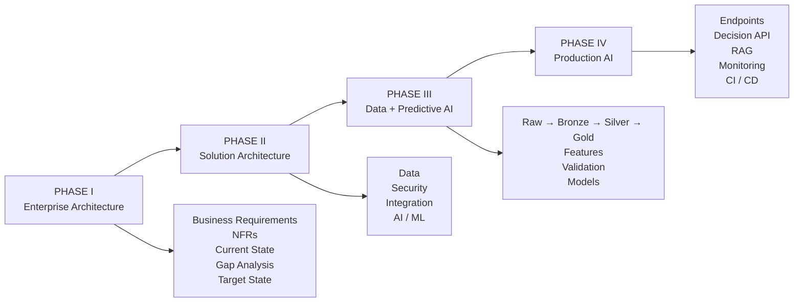
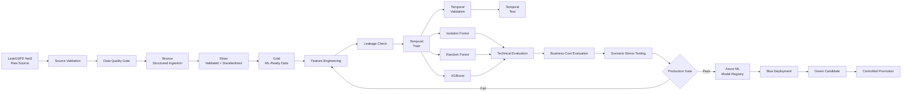
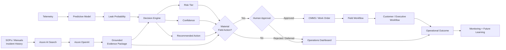

# Velaqua Water Intelligence Platform

[](https://github.com/DougMoore123/Velaqua-Water-intelligence-Platform/actions/workflows/ci.yml)

### Enterprise AI Decision Intelligence for Water Distribution Networks

**Microsoft Azure · Data Engineering · Predictive AI · MLOps · GenAI/RAG · Human-in-the-Loop Governance**

> **Velaqua** is an Azure-based enterprise AI platform designed to transform water-network telemetry into leak-risk predictions, evidence-backed incident recommendations, and governed operational actions.

| Platform Attribute | Implementation |
|---|---|
| **Release Position** | Pre-Production Reference Implementation |
| **Primary Benchmark** | LeakG3PD — Net3 |
| **Cloud Platform** | Microsoft Azure |
| **Data Platform** | ADLS Gen2 + Azure Databricks / PySpark |
| **Machine Learning** | Azure Machine Learning + MLflow |
| **Decision Intelligence** | FastAPI |
| **GenAI / RAG** | Azure AI Search + Azure OpenAI |
| **Infrastructure as Code** | Azure Bicep |
| **CI/CD** | GitHub Actions |
| **Governance** | Human approval, model gates, monitoring, rollback |

---

## Executive Summary

Water utilities increasingly operate across smart meters, pressure and flow sensors, SCADA systems, hydraulic models, asset-management platforms, work-management systems, and customer-service environments.

The enterprise challenge is not simply collecting telemetry.

The harder problem is converting distributed operational signals into a **timely, explainable, traceable, and accountable decision**.

Velaqua addresses that problem as an end-to-end AI decision-intelligence platform.

The platform combines governed data ingestion, scalable data engineering, predictive leak intelligence, temporal model validation, model lifecycle controls, real-time inference, retrieval-augmented evidence, human authorization, observability, security, and controlled release engineering.

A foundational design principle is:

> **A model prediction is not the business outcome.**

Velaqua therefore separates **predictive intelligence** from **operational authority**.

The system can detect, prioritize, explain, and recommend. Material operational actions remain subject to attributable human authorization.

The current implementation uses **LeakG3PD Net3** as the primary predictive-AI benchmark while preserving an architecture capable of supporting future live AMI, SCADA, IoT, CMMS, GIS, asset, and customer-service data sources.

---

# Business Problem

A typical water-utility incident can require multiple systems and teams:

```text
Operational Signal
        ↓
Alarm / Complaint
        ↓
Investigation
        ↓
Diagnosis
        ↓
Leak Localization
        ↓
Prioritization
        ↓
Authorization
        ↓
Field Dispatch
        ↓
Resolution
        ↓
Outcome Capture
```

Fragmented environments create operational friction through siloed telemetry, manual evidence correlation, inconsistent thresholds, high false-positive burden, subject-matter-expert dependency, delayed field action, incomplete traceability, and weak feedback between operational outcomes and analytics.

Velaqua introduces a governed intelligence layer across this lifecycle.

| Business Need | Velaqua Response |
|---|---|
| Earlier leak identification | Predictive anomaly and leak detection |
| Lower alert fatigue | Risk- and confidence-based prioritization |
| Faster investigation | Correlated telemetry and network context |
| Better localization | Hydraulic and topology-aware features |
| Explainable decisions | Confidence, evidence, rationale, and citations |
| Safer field operations | Human authorization for material actions |
| Better operational learning | Incident outcomes returned to governed data products |
| Reusable AI capability | Shared data, ML, API, security, and MLOps foundation |

---

# Enterprise AI System Architecture

```mermaid
flowchart LR

    subgraph SRC["1 · WATER NETWORK & ENTERPRISE SOURCES"]
        S1["LeakG3PD / Net3"]
        S2["AMI / SCADA / IoT"]
        S3["CMMS / Asset / Customer Systems"]
    end

    subgraph ING["2 · INGESTION & LANDING"]
        I1["Azure Data Factory"]
        I2["Event Hubs / IoT Hub"]
        I3["ADLS Gen2<br/>Raw Source of Truth"]
    end

    subgraph DATA["3 · DATA ENGINEERING"]
        D1["Azure Databricks<br/>PySpark"]
        D2["Bronze"]
        D3["Silver"]
        D4["Gold"]
    end

    subgraph ML["4 · PREDICTIVE AI"]
        M1["Feature Engineering"]
        M2["Azure ML + MLflow"]
        M3["Model Suite"]
        M4["Technical + Business Evaluation"]
        M5{"Production Model Gate"}
        M6["Azure ML Model Registry"]
    end

    subgraph SERVE["5 · MODEL SERVING"]
        E1["Azure ML Endpoint"]
        E2["FastAPI Decision API"]
        E3["API Management"]
    end

    subgraph DI["6 · DECISION INTELLIGENCE"]
        F1["Risk"]
        F2["Confidence"]
        F3["Evidence"]
        F4["Recommended Action"]
    end

    subgraph RAG["7 · GENAI / RAG"]
        G1["SOPs / Manuals / Incident History"]
        G2["Azure AI Search"]
        G3["Azure OpenAI"]
        G4["Grounded Evidence Package"]
    end

    subgraph EXEC["8 · BUSINESS EXECUTION"]
        H1{"Material Field Action?"}
        H2["Human Authorization"]
        H3["CMMS / Field Workflow"]
        H4["Operations Dashboard"]
        H5["Customer / Executive Workflows"]
    end

    S1 --> I1
    S2 --> I2
    S3 --> I1

    I1 --> I3
    I2 --> I3

    I3 --> D1
    D1 --> D2
    D2 --> D3
    D3 --> D4

    D4 --> M1
    M1 --> M2
    M2 --> M3
    M3 --> M4
    M4 --> M5

    M5 -->|Pass| M6
    M5 -->|Fail| M2

    M6 --> E1
    E1 --> E2
    E2 --> E3

    E3 --> F1
    E3 --> F2
    E3 --> F3
    E3 --> F4

    G1 --> G2
    G2 --> G3
    G3 --> G4
    G4 --> F3

    F1 --> H1
    F2 --> H1
    F3 --> H1
    F4 --> H1

    H1 -->|Yes| H2
    H2 -->|Approved| H3
    H2 -->|Rejected / Deferred| H4

    H1 -->|No| H4

    H3 --> H5
    H4 --> H5

    subgraph CTRL["9 · CROSS-CUTTING CONTROL PLANE"]
        C1["Entra ID / Managed Identity / Key Vault"]
        C2["Azure Monitor / App Insights / Log Analytics"]
        C3["Purview / Azure Policy"]
        C4["Defender / Sentinel"]
        C5["GitHub Actions / CI-CD"]
        C6["Blue-Green / Rollback / Approval Gates"]
    end
```



## Architecture Principles

**Business-first architecture**  
Technology decisions trace back to operational outcomes, functional requirements, non-functional requirements, and governance obligations.

**Separation of concerns**  
Telemetry streaming, batch movement, APIs, governed data, model lifecycle, and business execution are treated as separate architectural responsibilities.

**Governed data before governed AI**  
Raw source evidence remains traceable through Bronze, Silver, and Gold layers before model development.

**Temporal integrity**  
Time-series validation is chronological so future information cannot contaminate training.

**Human decision rights**  
AI recommendations do not independently authorize material physical actions.

**Evidence over invention**  
Generative AI is used as a grounded evidence service rather than autonomous operational authority.

**Fail-safe release engineering**  
Production promotion requires measurable acceptance criteria, monitoring, approval, and rollback.

---

# Architecture-to-Production Lifecycle

Velaqua follows a formal enterprise architecture and implementation lifecycle.

| Phase | Purpose | Scope |
|---|---|---|
| **Phase I — Enterprise Architecture Foundation** | Establish the business and architecture contract | Business context, pain points, objectives, stakeholders, FRs, NFRs, current state, gap analysis, target state |
| **Phase II — Detailed Solution Architecture** | Translate requirements into implementable architecture | Data, Security, Integration, AI/ML architecture and Azure technology decisions |
| **Phase III — Data Foundation & Predictive AI** | Build the governed data and predictive intelligence layer | Source validation, DQ, Bronze/Silver/Gold, features, temporal validation, model comparison |
| **Phase IV — Production AI & Application Delivery** | Operationalize the platform | Endpoints, APIs, RAG, human approval, CI/CD, observability, security, rollback |



The implementation is intentionally architecture-led.

It did **not** begin with model training.

---

# Data Architecture

## Primary Benchmark

The active predictive-AI implementation uses:

**LeakG3PD — Net3**

Earlier enterprise and solution architecture work used **BattLeDIM / L-Town** as the reference benchmark.

The change is treated as an architecture decision rather than silently rewriting project history.

```text
BattLeDIM / L-Town
Architecture Baseline
        ↓
LeakG3PD / Net3
Primary Implementation Benchmark
        ↓
Additional Networks / BattLeDIM
External Generalization Validation
```

The formal decision should be retained under:

```text
docs/architecture/decisions/ADR-001-dataset-selection.md
```

---

## Medallion Architecture

```text
ADLS Gen2
│
├── raw/
│   └── Immutable source evidence
│
├── bronze/
│   └── Structured ingestion + source metadata
│
├── silver/
│   └── Validated, standardized, aligned telemetry
│
└── gold/
    └── ML-ready and analytics-ready governed products
```

### Raw Layer

The Raw layer preserves:

- original source files,
- source fidelity,
- provenance,
- scenario information,
- replay and reprocessing capability.

Raw data is not overwritten by downstream transformation logic.

### Bronze Layer

Bronze provides:

- explicit schemas,
- ingestion metadata,
- source identifiers,
- scenario identifiers,
- structured Delta/Parquet-ready ingestion.

### Silver Layer

Silver provides:

- timestamp normalization,
- canonical sensor identifiers,
- unit standardization,
- duplicate handling,
- missing-value controls,
- pressure/flow/demand alignment,
- label alignment,
- network-reference validation.

Invalid records are quarantined instead of silently discarded.

### Gold Layer

Gold publishes:

- ML-ready telemetry,
- aligned targets,
- engineered features,
- topology context,
- operational KPIs,
- governed analytical products.

---

# Data & Predictive AI Lifecycle



The predictive-AI lifecycle includes:

- source validation,
- data-quality checks,
- chronological train/validation/test separation,
- leakage prevention,
- real-versus-synthetic source tracking,
- comparable model evaluation,
- calibration analysis,
- threshold sensitivity,
- scenario stress testing,
- business-cost analysis,
- explicit model promotion gates.

---

# Machine Learning Strategy

Velaqua uses a **baseline-first model-development strategy**.

Model complexity is introduced only when evidence supports it.

## Implemented Model Families

- Isolation Forest
- Random Forest
- XGBoost

## Advanced Candidate Families

The architecture supports future evaluation of:

- Autoencoders
- LSTM / temporal neural architectures
- Graph Neural Networks

Advanced models are not treated as automatically superior.

Their adoption must demonstrate measurable improvement in generalization, detection delay, false-alarm burden, topology awareness, operational usefulness, or business value.

---

## Feature Engineering

Feature families include:

### Pressure

- rolling averages,
- rolling standard deviation,
- pressure deltas,
- rate of change,
- deviation from baseline,
- network-relative behavior.

### Flow

- rolling statistics,
- flow change,
- imbalance,
- abnormal-flow signatures.

### Demand

- rolling demand,
- demand deviation,
- normalized consumption behavior.

### Temporal

- lag features,
- rolling windows,
- hour of day,
- day of week,
- time-dependent operating context.

### Network

- sensor/node identifiers,
- asset relationships,
- hydraulic topology,
- network neighborhood context.

---

# Model Governance

Production selection is not based solely on accuracy.

The evaluation framework considers:

- Precision
- Recall
- F1
- PR-AUC
- Confusion matrix
- False positives
- False negatives
- Detection delay
- False-alarm frequency
- Probability calibration
- Threshold sensitivity
- Business cost of missed leaks
- Business cost of false alarms
- Value of early detection
- Scenario robustness
- Representative-data sufficiency

The lifecycle is traceable through:

```text
Dataset Version
      ↓
Feature Version
      ↓
Training Job
      ↓
Environment
      ↓
Evaluation
      ↓
Model Version
      ↓
Production Gate
      ↓
Approval
      ↓
Deployment
```

A production candidate should be attributable to its data version, feature logic, code revision, environment, hyperparameters, experiment run, evaluation results, approval record, and deployed version.

---

# Decision Intelligence & Human Governance

Velaqua converts predictive output into governed operational decision support rather than exposing an isolated model probability.



## Human Authorization Control

A high-risk recommendation does not automatically grant permission to perform a physical intervention.

```text
Prediction
   ↓
Risk + Confidence
   ↓
Recommended Action
   ↓
Material Action?
   ↓
YES
   ↓
Human Approval Required
   ↓
Authorized Operator
   ↓
CMMS / Field Workflow
```

This separation between **intelligence** and **authority** is a core safety and governance control.

---

# Generative AI / RAG

The RAG layer provides **operational evidence**, not unrestricted autonomous advice.

Potential knowledge sources include:

- standard operating procedures,
- maintenance manuals,
- repair procedures,
- asset guidance,
- historical incidents,
- operational policies.

```text
Enterprise Knowledge
        ↓
Azure AI Search
        ↓
Retrieved Evidence
        ↓
Azure OpenAI
        ↓
Grounded Evidence Package
        ↓
Decision Intelligence
```

Implemented controls include:

- document retrieval,
- source citations,
- bounded context,
- grounding-oriented generation,
- retry behavior,
- safety blocklists,
- deterministic fallback,
- retrieval-quality evaluation.

If retrieval or generation fails, deterministic evidence can be returned rather than allowing the GenAI layer to block core decision processing.

---

# Decision API

The FastAPI decision service provides the operational intelligence layer.

| Endpoint | Purpose |
|---|---|
| `GET /health` | Liveness |
| `GET /ready` | Dependency and readiness status |
| `POST /predict` | Generate risk, confidence, recommendation, and evidence |
| `POST /incident` | Governed incident orchestration |
| `POST /incident/approval` | Human approval or rejection |
| `GET /kpi/executive` | Executive operational KPI summary |

The service implements:

- request IDs,
- schema validation,
- rate limiting,
- RAG integration,
- approval gating,
- health/readiness checks,
- configurable downstream integration contracts.

---

# Security Architecture

The target production posture follows an **identity-first, Zero-Trust-aligned** architecture.

Core controls include:

- Microsoft Entra ID
- Managed Identity
- Azure RBAC
- Azure Key Vault
- Azure API Management
- Azure Policy
- Microsoft Defender
- Microsoft Sentinel
- Private Endpoints / Private Link where justified
- least privilege
- encryption in transit
- encryption at rest
- auditable production approval

## Repository Secret Policy

The repository must not contain:

- production credentials,
- storage account keys,
- SAS tokens,
- API secrets,
- private certificates,
- service-principal passwords,
- runtime `.env` files.

Configuration templates belong in:

```text
.env.example
```

Runtime secrets belong in approved secret-management and identity systems.

---

# MLOps & Release Engineering

Velaqua treats model deployment as a controlled software-release process.

```text
Developer Change
      ↓
GitHub
      ↓
Pull Request
      ↓
Lint + Automated Tests
      ↓
Model Governance Gate
      ↓
Infrastructure / Deployment
      ↓
Blue Deployment
      ↓
Smoke Test
      ↓
Green Candidate
      ↓
Blue / Green Comparison
      ↓
Human Production Approval
      ↓
Promotion
      ↓
Monitoring
```

## Continuous Integration

The GitHub Actions CI workflow covers:

- Ruff linting,
- unit tests,
- API tests,
- model tests,
- schema tests,
- data-quality tests,
- model-governance tests,
- inference tests,
- deployment tests,
- approval-gate tests,
- orchestration tests.

## Continuous Delivery

The deployment workflow includes:

- quality gates,
- model-performance validation,
- Azure authentication,
- Bicep deployment,
- endpoint deployment,
- blue/green comparison,
- rollback validation,
- protected production approval,
- controlled promotion.

---

# Blue / Green Release Strategy

```text
                   ┌───────────────┐
                   │ Azure ML      │
                   │ Endpoint      │
                   └───────┬───────┘
                           │
              ┌────────────┴────────────┐
              │                         │
              ▼                         ▼
       ┌─────────────┐           ┌─────────────┐
       │    BLUE     │           │    GREEN    │
       │ Current     │           │ Candidate   │
       │ Production  │           │ Release     │
       └─────────────┘           └─────────────┘
              │                         │
              └────────────┬────────────┘
                           ▼
                  Compare / Validate
                           │
                  ┌────────┴────────┐
                  │                 │
                  ▼                 ▼
               Promote          Roll Back
```

Production changes are expected to be reversible.

---

# Observability

Observability is divided into four domains.

## Infrastructure

- CPU
- memory
- endpoint health
- autoscaling behavior
- availability
- request volume

## Application

- average latency
- p95 latency
- p99 latency
- HTTP failures
- timeouts
- request IDs
- dependency failures

## Machine Learning

- data quality
- missingness
- schema changes
- feature drift
- prediction drift
- confidence drift
- model quality
- detection delay

## Business

- leak alerts
- false alarms
- missed leaks
- confirmed leaks
- operator approvals
- material field actions
- detection-to-response time
- operational outcomes

Target observability services include:

- Azure Monitor
- Application Insights
- Log Analytics
- Azure ML monitoring
- Microsoft Sentinel

---

# Current Validation Snapshot

The current repository reports the following engineering evidence.

| Control Domain | Current State |
|---|---|
| Automated test suite | **35 passed, 0 failed** |
| Ruff static analysis | **Passing** |
| API contracts | Validated |
| Schema / data-quality tests | Validated |
| Model-governance tests | Validated |
| Temporal validation logic | Implemented |
| Model comparison | Implemented |
| Scenario stress testing | Implemented |
| RAG grounding controls | Implemented |
| Human-action authorization | Implemented |
| Blue / green automation | Implemented |
| Rollback automation | Implemented |
| Monitoring instrumentation | Implemented |
| Production model evidence | **Blocked — insufficient representative real data** |
| Final production approval | **Not granted** |

The distinction between **implemented controls** and **production-valid evidence** is intentional.

---

# Current Model Evidence

The current model snapshot is treated as engineering evidence, not production proof.

```text
37 total rows
3 real rows
34 synthetic rows
```

The real-only holdout is too small to support a defensible production performance claim.

The model gate therefore requires minimum representative-data thresholds.

| Requirement | Minimum | Current | Status |
|---|---:|---:|---|
| Real training rows | 200 | 3 | **Blocked** |
| Real validation rows | 30 | 1 | **Blocked** |
| Real test rows | 100 | 1 | **Blocked** |
| Real test leak events | 10 | 1 | **Blocked** |

This prevents attractive metrics produced from an undersized holdout from being interpreted as production evidence.

Current model evidence is available under:

```text
governance/model_findings_summary.md
governance/model_classification_reports/
ml/training/artifacts/model_suite/
```

---

# Operational Monitoring Snapshot

Synthetic monitoring is currently used to validate instrumentation and alert logic.

It is **not** treated as equivalent to live production telemetry.

| Metric | Observed | Threshold | Status |
|---|---:|---:|---|
| Average latency | 145.09 ms | < 350 ms | Pass |
| P95 latency | 201.59 ms | < 1,000 ms | Pass |
| P99 latency | 218.02 ms | < 1,500 ms | Pass |
| Availability | 99.67% | >= 99.5% | Pass |
| Error rate | 0.67% | < 1% | Pass |
| Average CPU | 33.72% | < 80% | Pass |
| Average memory | 47.95% | < 80% | Pass |
| Prediction drift PSI | 0.032 | < 0.2 | Pass |
| Confidence drift PSI | 0.205 | < 0.2 | **Watch** |
| Missing value rate | 7.98% | < 3% | **Watch** |
| Average detection delay | 6.88 min | < 20 min | Pass |

Synthetic false-alarm and missed-leak metrics are not considered production-valid outcome evidence.

Monitoring evidence is available under:

```text
governance/monitoring_report.json
governance/slo_and_alerts.md
docs/monitoring_validation_playbook.md
```

---

# Production Release Gates

Production promotion requires:

- representative real-data sufficiency,
- model-quality acceptance,
- temporal validation,
- scenario robustness,
- endpoint smoke tests,
- load validation,
- timeout validation,
- security validation,
- monitoring validation,
- blue/green comparison,
- rollback validation,
- accountable human approval,
- production SLO acceptance.

## Current Release Blockers

**1. Representative real-data sufficiency**

The current model snapshot does not meet the required real-data minimums.

**2. Final production approval**

The production approval artifact remains incomplete and must contain accountable approver metadata before promotion.

**3. Production-like monitoring evidence**

Synthetic monitoring validates instrumentation but must be replaced or corroborated by representative operational telemetry.

**4. Target Azure environment validation**

Cloud-dependent endpoint, security, monitoring, RAG, networking, and scaling controls must be verified in the intended production environment.

### Current Verdict

> **PRE-PRODUCTION — NO-GO for unrestricted production promotion until the release blockers are resolved.**

A production AI platform should be capable of returning **NO-GO** when the available evidence does not support a safe release.

---

# Repository Structure

```text
Velaqua-Water-intelligence-Platform/
│
├── .github/
│   └── workflows/
│       ├── ci.yml
│       ├── deploy.yml
│       └── repository-workflow.yml
│
├── dashboards/
│
├── docs/
│   ├── architecture.md
│   ├── aml_v1_realtime_endpoint_ops.md
│   ├── blue_green_release_runbook.md
│   ├── cicd_and_governance_checklist.md
│   ├── monitoring_validation_playbook.md
│   └── rag_quality_and_safety.md
│
├── governance/
│   ├── model_classification_reports/
│   ├── model_findings_summary.md
│   ├── monitoring.md
│   ├── monitoring_report.json
│   ├── ownership_and_procedures.md
│   ├── production_approval_record.json
│   ├── production_readiness_review.md
│   ├── scaling_strategy.md
│   └── slo_and_alerts.md
│
├── infra/
│   └── bicep/
│       ├── main.bicep
│       └── parameters.dev.json
│
├── ml/
│   ├── deployment/
│   │   ├── schemas/
│   │   ├── score.py
│   │   ├── online-endpoint.yml
│   │   ├── online-deployment.yml
│   │   ├── batch-endpoint.yml
│   │   └── batch-deployment.yml
│   │
│   └── training/
│       ├── config/
│       ├── environment/
│       └── src/
│
├── notebooks/
│
├── platform/
│   ├── databricks/
│   │   ├── config/
│   │   ├── jobs/
│   │   └── workflows/
│   │
│   ├── ingestion/
│   │   └── adf/
│   │
│   └── streaming/
│
├── scripts/
│
├── services/
│   ├── decision_api/
│   ├── rag_service/
│   └── shared/
│
├── tests/
│
├── .env.example
├── .gitignore
├── docker-compose.yml
├── pyproject.toml
└── README.md
```

---

# Formal Architecture Package

The next documentation layer for the repository is:

```text
docs/architecture/
│
├── README.md
│
├── diagrams/
│   ├── azure-ai-system.mmd
│   ├── azure-ai-system.svg
│   ├── predictive-ai-lifecycle.mmd
│   ├── predictive-ai-lifecycle.svg
│   ├── decision-governance.mmd
│   └── decision-governance.svg
│
├── phase-01-enterprise-foundation/
│   ├── README.md
│   ├── Velaqua_Phase_I_Enterprise_Architecture.pdf
│   └── diagrams/
│
├── phase-02-solution-architecture/
│   ├── README.md
│   ├── Velaqua_Phase_II_Solution_Architecture.pdf
│   └── diagrams/
│
├── phase-03-data-predictive-ai/
│   ├── README.md
│   ├── Velaqua_Phase_III_Data_Predictive_AI.pdf
│   └── diagrams/
│
├── phase-04-production-ai/
│   └── README.md
│
└── decisions/
    ├── ADR-001-dataset-selection.md
    ├── ADR-002-medallion-architecture.md
    ├── ADR-003-model-serving.md
    ├── ADR-004-human-approval-control.md
    └── ADR-005-rag-evidence-pattern.md
```

The Phase I, II, and III formal architecture reports should be published as **PDF** for repository review.

Editable DOCX source files may also be retained separately, but PDF and Markdown should be the primary GitHub-facing documentation formats.

---

# Architecture Decision Records

Major architectural decisions should be preserved through ADRs.

| ADR | Decision |
|---|---|
| **ADR-001** | LeakG3PD / Net3 selected as the primary implementation benchmark |
| **ADR-002** | Medallion architecture selected for governed telemetry processing |
| **ADR-003** | Azure Machine Learning selected for model lifecycle and serving |
| **ADR-004** | Human authorization required for material operational actions |
| **ADR-005** | RAG used as an evidence service rather than autonomous decision authority |

This makes significant design evolution explicit and auditable.

---

# Getting Started

## Prerequisites

Recommended development environment:

```text
Python: 3.11
IDE: VS Code
Cloud: Microsoft Azure
Source Control: Git / GitHub
```

Depending on the workflow, Azure access may be required for:

- Azure Machine Learning
- ADLS Gen2
- Azure Databricks
- Azure AI Search
- Azure OpenAI
- Azure Monitor
- Application Insights
- Microsoft Sentinel

---

## Clone the Repository

```bash
git clone https://github.com/DougMoore123/Velaqua-Water-intelligence-Platform.git
cd Velaqua-Water-intelligence-Platform
```

---

## Create Virtual Environment

### Linux / Azure ML Compute

```bash
python -m venv .venv
source .venv/bin/activate
```

### Windows

```powershell
py -3.11 -m venv .venv
.venv\Scripts\activate
```

---

## Install Dependencies

```bash
python -m pip install --upgrade pip

pip install -r services/decision_api/requirements.txt
pip install -r services/rag_service/requirements.txt
pip install -r ml/training/requirements.txt

pip install pytest ruff
```

---

# Local Service Development

Docker Compose can start both primary application services:

```bash
docker compose up
```

| Service | Port |
|---|---:|
| Decision Intelligence API | `8000` |
| RAG Evidence Service | `8001` |

Or run each service independently.

### RAG Service

```bash
uvicorn services.rag_service.app.main:app \
  --reload \
  --port 8001
```

### Decision API

```bash
uvicorn services.decision_api.app.main:app \
  --reload \
  --port 8000
```

---

# Testing

Run static analysis:

```bash
ruff check services ml scripts tests platform
```

Run the complete automated test suite:

```bash
pytest -q
```

The CI verification flow is:

```text
Lint
 ↓
Unit Tests
 ↓
API Tests
 ↓
Model Tests
 ↓
Schema / Data Quality Tests
 ↓
Deployment / Governance Tests
```

---

# Model Training

Primary model-development code lives under:

```text
ml/training/src/
```

The current model suite includes:

- temporal train/validation/test splitting,
- real-only holdout support,
- leakage detection,
- Isolation Forest,
- Random Forest,
- XGBoost,
- calibration,
- threshold sweeps,
- PR-AUC,
- detection delay,
- false-alarm frequency,
- business-cost scoring,
- MLflow logging,
- data-sufficiency gates.

Example:

```bash
python ml/training/src/train_model_suite.py \
  --gold-path <gold-dataset.parquet> \
  --output-dir ml/training/artifacts/model_suite \
  --enforce-real-holdout \
  --enforce-data-sufficiency \
  --enforce-production-gate
```

---

# Deployment

## End-to-End Release Chain

```bash
./scripts/run_e2e_pipeline_v1.sh
```

The workflow covers:

```text
Candidate Validation
        ↓
Model Registration
        ↓
Blue Deployment
        ↓
Smoke Test
        ↓
Approval Validation
```

## Deploy Green Candidate

```bash
./scripts/deploy_green_candidate_v1.sh
```

## Compare Blue and Green

```bash
./scripts/blue_green_compare_v1.sh | tee blue_green_compare.json
```

## Promote Green

```bash
COMPARE_REPORT=blue_green_compare.json \
./scripts/promote_green_v1.sh
```

## Roll Back

```bash
./scripts/rollback_to_blue_v1.sh
./scripts/smoke_test_realtime_endpoint_v1.sh
```

---

# Monitoring & SLOs

Run the monitoring and security orchestration flow:

```bash
./scripts/run_monitoring_security_orchestrator.sh
```

Generate operational metrics:

```bash
python scripts/monitor_operational_metrics.py \
  --baseline <baseline_predictions.jsonl> \
  --current <current_predictions.jsonl> \
  --output governance/monitoring_report.json
```

The platform defines operational objectives around:

- availability,
- average latency,
- p95 latency,
- p99 latency,
- error rate,
- missing-data rate,
- prediction drift,
- confidence drift,
- false alarms,
- missed leaks,
- detection delay.

See:

```text
governance/slo_and_alerts.md
governance/monitoring.md
docs/monitoring_validation_playbook.md
```

---

# Engineering Evidence Index

| Capability | Evidence |
|---|---|
| Architecture mapping | `docs/architecture.md` |
| Data engineering | `platform/databricks/` |
| Batch ingestion | `platform/ingestion/` |
| Streaming integration | `platform/streaming/` |
| ML training | `ml/training/` |
| Model serving | `ml/deployment/` |
| Decision intelligence | `services/decision_api/` |
| GenAI / RAG | `services/rag_service/` |
| Infrastructure as Code | `infra/bicep/` |
| Automated tests | `tests/` |
| CI/CD | `.github/workflows/` |
| Model findings | `governance/model_findings_summary.md` |
| Monitoring evidence | `governance/monitoring_report.json` |
| Production readiness | `governance/production_readiness_review.md` |
| Production approval | `governance/production_approval_record.json` |
| Blue / green runbook | `docs/blue_green_release_runbook.md` |
| Monitoring runbook | `docs/monitoring_validation_playbook.md` |
| RAG safety | `docs/rag_quality_and_safety.md` |

---

# Known Limitations

## Benchmark-Based Development

The primary predictive implementation uses public benchmark/simulated water-network data rather than production telemetry from an operating utility.

Therefore, benchmark performance must not be interpreted as guaranteed production performance on an unseen physical network.

Production adoption requires utility-specific validation of:

- telemetry distributions,
- sensor behavior,
- hydraulic conditions,
- topology,
- demand patterns,
- operating thresholds,
- field procedures,
- enterprise integration interfaces.

## Real-Data Model Evidence

The current production gate correctly identifies insufficient representative real-data coverage for unrestricted promotion.

## Synthetic Monitoring

Synthetic telemetry is suitable for testing instrumentation, pipelines, metrics, alerts, and drift logic.

It does not replace representative production monitoring evidence.

## Enterprise Integrations

CMMS, field-service, customer-service, and dashboard integrations are represented through configurable contracts and endpoints.

Production integration requires organization-specific systems, identities, permissions, and credentials.

---

# Roadmap

Future platform expansion includes:

- representative live utility telemetry,
- additional LeakG3PD networks,
- BattLeDIM external benchmarking,
- cross-network generalization,
- topology-aware graph modeling,
- production AMI integration,
- live SCADA integration,
- GIS integration,
- CMMS integration,
- predictive asset maintenance,
- demand forecasting,
- pressure optimization,
- asset-risk scoring,
- production knowledge indexing,
- operational dashboard implementation,
- advanced drift monitoring,
- governed retraining workflows,
- disaster-recovery testing,
- multi-region resilience where justified by business requirements.

---

# Engineering Position

Velaqua is intentionally designed as more than a machine-learning demonstration.

```text
Business Problem
      ↓
Requirements
      ↓
Enterprise Architecture
      ↓
Solution Architecture
      ↓
Governed Data
      ↓
Feature Engineering
      ↓
Predictive AI
      ↓
Model Governance
      ↓
Production Serving
      ↓
Decision Intelligence
      ↓
RAG Evidence
      ↓
Human Authorization
      ↓
Operational Execution
      ↓
Monitoring
      ↓
Continuous Improvement
```

The objective is not simply to generate a leak prediction.

The objective is to build an AI system whose predictions can be:

**validated, traced, governed, explained, challenged, operationalized, monitored, rolled back, and safely acted upon.**

---

# Current Release Position

## Pre-Production Reference Implementation

The repository demonstrates engineering controls across:

- data ingestion,
- medallion data engineering,
- ML development,
- temporal validation,
- model governance,
- serving,
- decision intelligence,
- RAG,
- human approval,
- CI/CD,
- observability,
- security,
- blue/green deployment,
- rollback,
- release governance.

Velaqua is **not represented as an unrestricted production deployment**.

Production promotion remains blocked until:

1. representative real-data requirements are satisfied,
2. the selected model is retrained and revalidated,
3. production-like telemetry monitoring is completed,
4. Azure-dependent controls are verified in the target environment,
5. final accountable production approval is recorded.

That distinction is deliberate.

> **A production AI system should be capable of returning NO-GO when the available evidence does not support a safe release.**

---

## Author

**Douglas Moore**

AI / Machine Learning · Data Science · AI Solutions Architecture

---

## Disclaimer

Velaqua is a portfolio and reference implementation demonstrating enterprise AI architecture, predictive analytics, MLOps, GenAI/RAG, and water-utility decision intelligence.

It is not intended to autonomously control physical water infrastructure without organization-specific engineering validation, cybersecurity review, operational approval, and human oversight.


